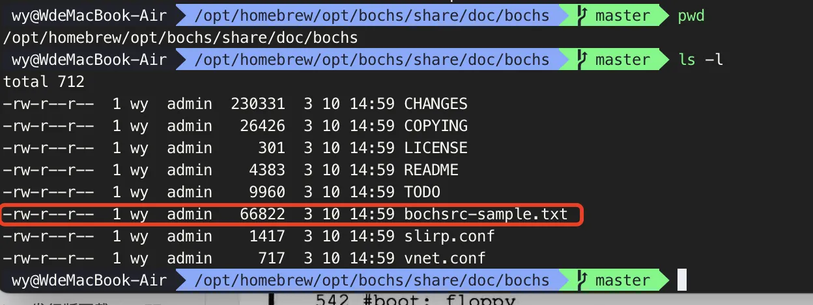

# mini-os
跟着《操作系统真象还原》书写一个小系统，目的是通过写代码的过程中熟悉linux、以及C语言。我使用的是mac air m2，因此bochs配置会有所不同，以及后续编译C语言代码的时候会略有不同。
在跟着《操作系统真象还原》写代码前，我也看了《x86汇编语言：从实模式到保护模式（第2版)》一书，对x86架构的一些知识点有所了解。


## 已实现功能
- 2024-05-25
通过bios提供的中断程序打印helloword功能的MBR程序，可用的bochs配置文件，串联各个步骤的Makefile编写


# bochs配置

bochs版本是2.8，使用brew方式安装的
```shell
brew install bochs
```
此外还要安装sdl2
```shell
brew install sdl2
```
安装完成后，配置bochs，
1、从bochs的安装目录下复制配置文件模板，由于是brew安装的因此，模版文件目录是在



2、需要修改配置文件中的选项如下：
```
# 交叉编译的时候使用这个
display_library: sdl2

# host设置bochs使用的内存, guest设置被模拟系统认为自己有多少内存 , block_size是指一个块的大小
memory: guest=64, host=64, block_size=512

# bios程序
romimage: file=/opt/homebrew/opt/bochs/share/bochs/BIOS-bochs-latest

# vgabios程序
vgaromimage: file=/opt/homebrew/opt/bochs/share/bochs/VGABIOS-lgpl-latest

# 启动方式为硬盘启动
boot: disk

# 指定启动硬盘文件在哪里
ata0: enabled=1, ioaddr1=0x1f0, ioaddr2=0x3f0, irq=14
ata0-master: type=disk, mode=flat, path="./build/hd.img"
```


# 运行说明
通过make命令编译程序、创建磁盘并编译后的机器码写入磁盘、运行bochs,详细请看Makefile。makefile知识在《操作系统真象还原》第8.1小节。
以下是运行命令的顺序：
```bash
# 编译程序、创建磁盘并编译后的机器码写入磁盘
make all
# 运行虚拟机启动我们写的操作系统
make bochs
```