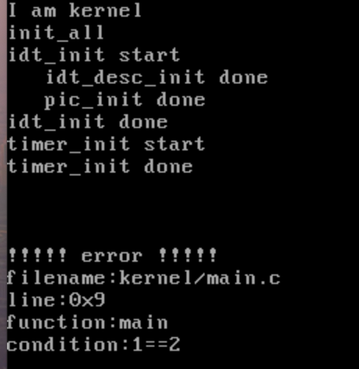

# assert与makefile


本节要做的事：  
1.实现内核用的assert  
2.实现两个自由开关中断的函数  
3.优化makefile

代码中有几处用了`xchg bx,bx`指令用于debug，bochs运行后需要在命令台输入`c`命令运行下去。当代码运行到最后，bochs面板效果如下时，表示本节的代码已经完成  



# assert
断言其实就是一个宏定义
```c
#ifdef NDEBUG
#define ASSERT(CONDITION) ((void)0)
#else
#define ASSERT(CONDITION)                                      \
      if (CONDITION) {} else {                                    \
  /* 符号#让编译器将宏的参数转化为字符串字面量 */		  \
	 PANIC(#CONDITION);                                       \
      }
#endif /*__NDEBUG */
```
如果在编译代码的时候没有加上`-DNDEBUG`选项，预处理就会将`ASSERT(CONDITION)`
替换成`((void)0)` ,这个是C、C++里面的空操作表达式，类似于`python`的`pass`

assert示例如下：
```c
assert(1==2);
```
`1==2`的运算结果就是宏定义中的`CONDITION`，假设编译的时候没有`-DNDEBUG`选项，`assert(1==2)`替换后的代码如下
```c
 if (1==2) {} else {                                    \
  /* 符号#让编译器将宏的参数转化为字符串字面量 */		  \
	 PANIC("1==2");                                       \
 }
```

#CONDITION 意思是将代码转换成字符串，所以是`PANIC("1==2")`

# 开关中断函数
打开和关闭中断，其实就是操作eflags寄存器中if位，由于C语言无法直接操作寄存器，
因此需要用到内联汇编。
```c
asm volatile("cli" : : : "memory"); // 关中断,cli指令将IF位置0
asm volatile("sti");	 // 开中断,sti指令将IF位置1
```
随书代码中，先获取当前中断开关的状态，然后根据状态进行操作

```c
    enum intr_status old_status;
    if (INTR_ON == intr_get_status()) {
        old_status = INTR_ON;
        asm volatile("cli" : : : "memory"); // 关中断,cli指令将IF位置0
        return old_status;
    } else {
        ...
    }
```
在intr_get_status中是使用了宏定义的GET_EFLAGS获取的if位的值.
eflags无法直接读取，这里是通过将eflags写入栈中，然后通过pop指令返回获取的
```c
#define GET_EFLAGS(EFLAG_VAR) asm volatile("pushfl; popl %0" : "=g" (EFLAG_VAR))

/* 获取当前中断状态 */
enum intr_status intr_get_status() {
    uint32_t eflags = 0;
    GET_EFLAGS(eflags);
    return (EFLAGS_IF & eflags) ? INTR_ON : INTR_OFF;
}

```


# 优化makefile

我自己写的makefile文件中，有以下问题：  
1.每次新增一些类的时候，就要手动加一条目标规则
2.目标规则太多了，能不能合并起来，减少规则


## 使用匹配模式

新增的C脚本或者汇编脚本，它的编译命令和参数都是想同，不同的只是文件名，因此我们用makefile的模式规则和自带的变量来
完成脚本的编译。 

```makefile
#  boot目录下所有asm脚本编译并输出到build目录下，文件名为原文件名.o
${BUILD}/%.o: boot/%.asm
	nasm -f bin -i boot/include/ $< -o $@
```
boot/%.asm表示boot目录下所有asm文件。 因为boot目录下有`loader.asm`、`mbr.asm`两个文件，因此会执行两次nasm的命令，生成两个目标文件。
`$<`、`$@`都是makefile自带的变量，表示依赖文件的第一个文件的文件名，`$@`是目标文件名
执行nasm命令时，假设第一个执行的是loader,`$<`将被替换为`loader.asm`，而`$@`将被替换为`loader.o`


中间目标文件已经编译好了，剩下的就是最后一步用链接器ld链接中间目标文件，生成最终的内核文件kernel.bin。
ld命令处需要手工添加新的目标文件。因此要解决的问题是如何获取到所有需要的目标文件，解决办法是通过makefile内置的函数`wildcard`以及`patsubst` 
获取。 


wildcard 是一个内置函数，它用来获取匹配特定模式的文件列表。
这个函数非常有用，尤其是在你需要处理一组文件时，而这些文件又符合某个特定模式（如具有相同的文件扩展名）。

patsubst可以根据指定的模式搜索和替换字符串
```shell
$(patsubst pattern,replacement,text)
```
pattern：匹配模式，可以包含通配符 %。 如`%.c`表示所有后缀为c的文件  
replacement：替换模式，其中 % 代表被 pattern 中的 % 匹配的部分。如有个脚本`main.c`符合`%.c`匹配模式，`${BUILD}/%.o`就表示`build/main.o`   
text：要进行替换的字符串（通常是文件列表）。  

使用上面两个函数获取lib/kernel目录下的所有c脚本，将其名字替换成 `$(BUILD)/脚本名.o` 示例如下：
```makefile
# 自定义变量
BUILD=build
# 获取lib/kernel目录下所有的 .c 文件
C_SOURCES := $(wildcard lib/kernel/*.c)
O_TARGET := $(patsubst %.c,${BUILD}/%.o,$(notdir $(C_SOURCES)))

# 打印所有的 .c 和 .h 文件
all:
    @echo "C sources: $(C_SOURCES)"
    @echo "C headers: $(O_TARGET)"
```
执行all规则会输出以下内容
```shell
C sources: lib/kernel/debug.c lib/kernel/init.c lib/kernel/interrupt.c
C target: build/debug.o build/init.o build/interrupt.o
```
<font color="red">注意上面的makefile代码复制后，all规则下的命令前面的tab键可能会变成空格导致，执行的时候提示 nothing to do，需要手工将空格改回tab</font>


