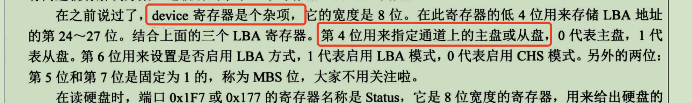

# 第13章 硬盘驱动

磁盘创建步骤以及完成效果，看笔记最后一节，本章工作如下：
1. 创建磁盘hd2.img,并使用fdisk分区工具对磁盘进行分区
2. 增加磁盘初始化函数并读取磁盘hd2的分区信息打印出来


本章有以下知识点：
1. 硬盘构造基础知识
2. 硬盘分区基础知识
3. fdisk命令分区
4. 硬盘相关知识


## 1.硬盘的结构


## 2.硬盘分区基础知识

### 2.1 什么是分区表
分区是指大佬们的将多个柱面划分为一个分区，是一种逻辑上的划分。一个柱面只能属于一个分区。到底哪些柱面属于哪个分区呢，这些信息记录在一个分表中。
这个分区表就在MBR中，整个表大小共64个字节。磁盘分区表是由分区工具fdisk创建的，英文全称是Disk Partition Table( DPT )。

通过clion的查看二进制插件BinEd查看使用fdisk进行分区后的内容如下：

在0x1bd后面的，是分区表，然后最后接着的是魔数55aa。

以前，硬盘容量小，大家认为没必要弄那么多分区，认为4个分区已经足够了，每个描述项占用16个字节，所以64个字节足够放了。
后续为了兼容以前的设计， 这块就保留下来了。

在这个“描述符”中有个属性是文件系统`id` ，它表示文件系统的类型。为支持更多的分区，专门增加一种 id 属性值（id值为5 ），
用来表示该分区可被再次划分出更多的子分区，这就是逻辑分区。因为只是在分区表项中通过属性来判断分区类型，所以这个分区中的任意一个都可以作为
扩展分区。扩展分区是可选项，有没有都行，但最多只有1个，1个扩展分区在理论上可被划分出任意多的子扩展分区，因此1个扩展分区足够了。


### 2.2 分区表的结构


以上是分区表项的结构，这里要了解几个概念，OBR、MBR、EBR。

#### OBR
MBR就是磁盘的第一个扇区，里面包含了引导程序、分区表、魔数。这里MRB中的引导程序，被称为
主引导程序，它的作用是将控制权转移到次引导程序中。所谓的次引导程序就是我们写的`loader.asm`,
其作用就是用来加载操作系统的。次引导程序一般在OBR中，OBR全称是`OS BOOT Record`。
OBR所在的扇区，是活动分区所在的第一个扇区，称为分区引导扇区。

活动分区就是分区表项中第一个字节值为0x80的项目对应的分区，主引导程序可以根据项中的编号
将整个分区引导扇区加载到内存中，然后跳转过去，将CPU的控制权交给次引导程序，负责加载操作系统代码。


#### EBR

为了能够支持更多的分区，文件系统类型ID（分区工具上都叫该字段为分区类型）为0x5的时候
该分区项中的倒数第二个字段 分区起始位置 指向的就是 EBR 。EBR就是拓展分区表所在的扇区。


#### 实践出真知

通过fdisk查看磁盘的分区信息如下：
```sehll

root@iZ7xv60bt3xh588holkr1fZ:~# fdisk hd20.img 

Welcome to fdisk (util-linux 2.37.2).
Changes will remain in memory only, until you decide to write them.
Be careful before using the write command.


Command (m for help): p
Disk hd20.img: 19.69 MiB, 20643840 bytes, 40320 sectors
Units: sectors of 1 * 512 = 512 bytes
Sector size (logical/physical): 512 bytes / 512 bytes
I/O size (minimum/optimal): 512 bytes / 512 bytes
Disklabel type: dos
Disk identifier: 0x8006e207

Device     Boot Start   End Sectors   Size Id Type
hd20.img1        2048  3072    1025 512.5K 83 Linux
hd20.img2        4096 24575   20480    10M  5 Extended
hd20.img5        6144  7168    1025 512.5K 83 Linux
hd20.img6       10240 11264    1025 512.5K 83 Linux
```

通过xxd查看MBR中的分区表
```shell

root@iZ7xv60bt3xh588holkr1fZ:~# xxd -s 0x1be -l 64 hd20.img
000001be: 0020 2100 8330 3100 0008 0000 0104 0000  . !..01.........
000001ce: 0041 0200 0587 0601 0010 0000 0050 0000  .A...........P..
000001de: 0000 0000 0000 0000 0000 0000 0000 0000  ................
000001ee: 0000 0000 0000 0000 0000 0000 0000 0000  ................

```

可以看到

05就是文件系统类型（又叫分区类型），然后后面的`0010 0000`，就是LBA地址
因为默认是小端字序，所以应该是`0x1000`,需要乘以扇区大小512,得到偏移量地址
是`0x200000`


查看拓展分区中的分区表，拓展分区表就在`0x200000`处的512个字节，这512字节又叫EBR


由于EBR和MBR结构上是一样的，所以可以
```shell
root@iZ7xv60bt3xh588holkr1fZ:~# xxd -s 0x2001be -l 64 hd20.img 
002001be: 0061 2200 8371 3200 0008 0000 0104 0000  .a"..q2.........
002001ce: 0082 0300 05b2 3300 0010 0000 010c 0000  ......3.........
002001de: 0000 0000 0000 0000 0000 0000 0000 0000  ................
002001ee: 0000 0000 0000 0000 0000 0000 0000 0000  ................

```
我们有两个逻辑分区，理论上可以看到这里有两个项，但是第二项中的分区类型是0x05。
扩展分区表是单向链表，这里的第二项并不是第二个分区，而是指向第二个分区的项。

因为逻辑分区是在扩展分区上划分的，所以第一个逻辑分区在磁盘的偏移量是
0x200000+0x0800 = 0x208000  


第二个分区的偏移量存储在下一个EBR中，所以要先根据第二项计算出EBR的地址
`0010 0000`对应的偏移量是  `0x1000 * 512  = 0x200000`
因此EBR在`0x200000 + 0x200000 = 0x400000`处，查看512个字节可以看到0x55aa
```shell
root@iZ7xv60bt3xh588holkr1fZ:~# xxd -s 0x400000 -l 512 hd20.img 
00400000: 0000 0000 0000 0000 0000 0000 0000 0000  ................
00400010: 0000 0000 0000 0000 0000 0000 0000 0000  ................
00400020: 0000 0000 0000 0000 0000 0000 0000 0000  ................
00400030: 0000 0000 0000 0000 0000 0000 0000 0000  ................
00400040: 0000 0000 0000 0000 0000 0000 0000 0000  ................
00400050: 0000 0000 0000 0000 0000 0000 0000 0000  ................
00400060: 0000 0000 0000 0000 0000 0000 0000 0000  ................
00400070: 0000 0000 0000 0000 0000 0000 0000 0000  ................
00400080: 0000 0000 0000 0000 0000 0000 0000 0000  ................
00400090: 0000 0000 0000 0000 0000 0000 0000 0000  ................
004000a0: 0000 0000 0000 0000 0000 0000 0000 0000  ................
004000b0: 0000 0000 0000 0000 0000 0000 0000 0000  ................
004000c0: 0000 0000 0000 0000 0000 0000 0000 0000  ................
004000d0: 0000 0000 0000 0000 0000 0000 0000 0000  ................
004000e0: 0000 0000 0000 0000 0000 0000 0000 0000  ................
004000f0: 0000 0000 0000 0000 0000 0000 0000 0000  ................
00400100: 0000 0000 0000 0000 0000 0000 0000 0000  ................
00400110: 0000 0000 0000 0000 0000 0000 0000 0000  ................
00400120: 0000 0000 0000 0000 0000 0000 0000 0000  ................
00400130: 0000 0000 0000 0000 0000 0000 0000 0000  ................
00400140: 0000 0000 0000 0000 0000 0000 0000 0000  ................
00400150: 0000 0000 0000 0000 0000 0000 0000 0000  ................
00400160: 0000 0000 0000 0000 0000 0000 0000 0000  ................
00400170: 0000 0000 0000 0000 0000 0000 0000 0000  ................
00400180: 0000 0000 0000 0000 0000 0000 0000 0000  ................
00400190: 0000 0000 0000 0000 0000 0000 0000 0000  ................
004001a0: 0000 0000 0000 0000 0000 0000 0000 0000  ................
004001b0: 0000 0000 0000 0000 0000 0000 0000 00a2  ................
004001c0: 2300 83b2 3300 0008 0000 0104 0000 0000  #...3...........
004001d0: 0000 0000 0000 0000 0000 0000 0000 0000  ................
004001e0: 0000 0000 0000 0000 0000 0000 0000 0000  ................
004001f0: 0000 0000 0000 0000 0000 0000 0000 55aa  ..............U.

```
因为我们只有两个分区，第二个分区后所在的EBR处，只有一个项了，分区类型也是`0x83`了


0x200000+0x20000


 

## 3、fdisk分区工具进行分区
fdisk并不能指定起始扇区，然后我换了个parted工具来做实验，两个工具使用起来
感觉差不多。


### 3.1 生成磁盘，并进入fdiskd工具命令行中
```shell

# bximage 生成raw 格式磁盘
bximage -q -func=create -hd=20M hd20.img

# 进入fdisk工具命令行
fdisk hd20.img
```

### 3.2 分区


创建主分区以及扩展分区


在扩展分区上创建了两个逻辑分区


## 4.硬盘操作相关知识

### 第3章中给出操作硬盘的方法


### 硬盘的中断信号
旧的主板上有两个IDE接口（ATA接口），每个IDE接口上能接两个硬盘，分为主硬盘和从硬盘。
第一个IDE接口的中断信号是8259A从片上的IRQ14.两个硬盘共用一个中断信号。这个可以看bochs的模版配置文件
```text
#=======================================================================
# ATA0, ATA1, ATA2, ATA3
# ATA controller for hard disks and cdroms
#
# ata[0-3]: enabled=[0|1], ioaddr1=addr, ioaddr2=addr, irq=number
#
# These options enables up to 4 ata channels. For each channel
# the two base io addresses and the irq must be specified.
#
# ata0 and ata1 are enabled by default with the values shown below
#
# Examples:
#   ata0: enabled=1, ioaddr1=0x1f0, ioaddr2=0x3f0, irq=14
#   ata1: enabled=1, ioaddr1=0x170, ioaddr2=0x370, irq=15
#   ata2: enabled=1, ioaddr1=0x1e8, ioaddr2=0x3e0, irq=11
#   ata3: enabled=1, ioaddr1=0x168, ioaddr2=0x360, irq=9
```

如何区分中断信号是由哪个硬盘发出的？
硬盘不会主动发送中断信号，当我们需要操作硬盘的时候，通常都是先指定要读取哪个硬盘，此时会
将通道锁住，等待硬盘中断信号后才能继续操作。


### 如何选择主硬盘还是从硬盘

要知道如何选择主从硬盘需要先看看硬盘常用的几个寄存器


然后看device寄存器的作用



### 硬盘的命名规则


## 完成本章工作后的运行效果
创建磁盘hd2.img
```shell
bximage -q -func=create -hd=80M hd2.img
```

并进行分区，分区效果如下
```shell
Command (m for help): p
Disk hd2.img: 79.73 MiB, 83607552 bytes, 163296 sectors
Units: sectors of 1 * 512 = 512 bytes
Sector size (logical/physical): 512 bytes / 512 bytes
I/O size (minimum/optimal): 512 bytes / 512 bytes
Disklabel type: dos
Disk identifier: 0x460384df

Device     Boot Start    End Sectors  Size Id Type
hd2.img1         2048   4095    2048    1M 83 Linux
hd2.img2         4096 163295  159200 77.7M  5 Extended
hd2.img5         6144   8191    2048    1M 83 Linux
hd2.img6        10240  12287    2048    1M 83 Linux
```

执行效果如下：


由图上可见扇区数为0x800 也就是 2048个扇区与我们创建硬盘时信息一致。虽然打印的信息挤到到了前面，
没有滚屏的效果，应该是print.asm代码中有bug，但这不重要，留着后面再搞吧。