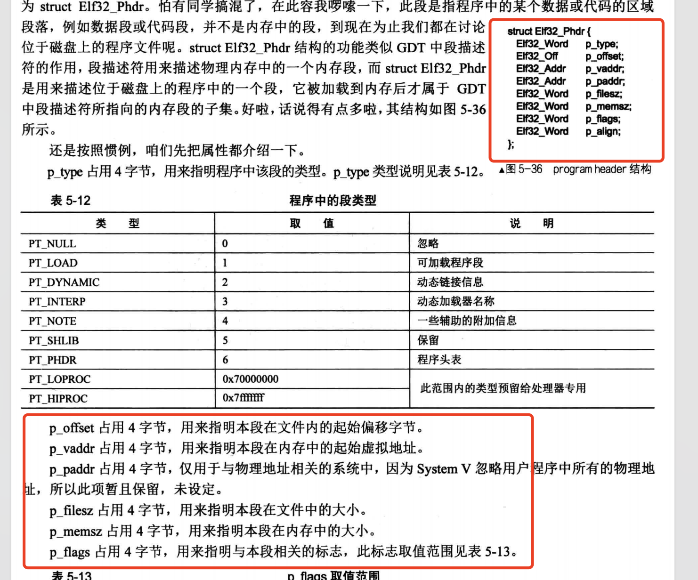
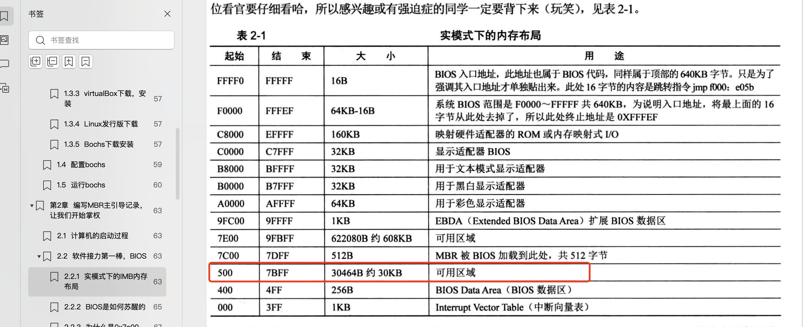

# 加载与初始化内核
本节主要做了以下几件事  
1、C语言写的内核(main.c)生成32位的ELF可执行文件  
2、将32位可执行文件二进制数据写入磁盘中  
3、加载器loader从磁盘中读取内核程序  
4、解析elf文件头，初始化内核  


因为用的是mac air m2开发，要将C语言编写的main.c要生成x86架构的32位ELF可执行文件，需要用到交叉编译。
交叉编译需要自己构建交叉编译工具链， 太麻烦了，所以用云服务器来编译C语言代码以及链接目标文件生成32位可执行文件。
将可执行文件下载到本地后，写入磁盘，运行bochs即可。 具体实现看Makefile的`bochs-remote`逻辑。  
[云服务器初始化笔记](云服务器开发环境搭建.md) 


本小节主要内容是如何解析elf文件头，并初始化内核。  
初始化其实就是根据elf文件头的信息，将代码段、数据段拷贝放到内存某个位置，创建新的页映射，然后跳转到该代码段上运行。

## 第一步，了解ELF文件头格式

elf的文件头格式在linux内核源码的这个位置 
`/..../linux-5.15.160/include/uapi/linux/elf.h`

```c
#define EI_NIDENT	16
typedef struct elf32_hdr {
  unsigned char	e_ident[EI_NIDENT];   /* 16个字节 */
  Elf32_Half	e_type;                 /* 2个字节,文件类型 */
  Elf32_Half	e_machine;          /* 占用2个字节，用来描述 elf 目标文件的体系结构类型, 如3是  Intel 80386 */
  Elf32_Word	e_version;           /*  占用4字节，用来表示版本信息 */  
  Elf32_Addr	e_entry;  /* Entry point ,4字节 用来指明操作系统运行该程序时，将控制权转交到的虚拟地址。*/
  Elf32_Off	e_phoff;        /* 占用4字节，用来指明程序头表（program header table ）在文件内的字节偏移量 若没有节头表，该值为0*/
  Elf32_Off	e_shoff;        /* 占用4字节，用来指明节头表（ section header table ）在文件内的字节偏移量。若没有节头表，该值为0 */
  Elf32_Word	e_flags;   
  Elf32_Half	e_ehsize; /* 占用 4字节，用来指明 elf header 的宇节大小。*/
  Elf32_Half	e_phentsize;  /* 占用2字节，用来指明程序头表（program header table ）中每个条目（ entry ）的字节大小 */
  Elf32_Half	e_phnum;    /* 占用2字节，用来指明程序头表中条目的数量。实际上就是段的个数。*/
  Elf32_Half	e_shentsize;  /* 占用2宇节，用来指明节头表（ section header table ）中每个条目的字节大小，即每个用来描述节信息的数据结构的字节大小。*/
  Elf32_Half	e_shnum;    /* 占用2字节，用来指明节头表中条目的数量。实际上就是节的个数。*/
  Elf32_Half	e_shstrndx; /* 占用2宇节，用来指明 string name table 在节头表中的索引 index */
} Elf32_Ehdr;


typedef struct elf32_phdr{
  Elf32_Word	p_type;    /* 4个字节，1表示是PT_LOAD 可加载程序段 */
  Elf32_Off	p_offset;       /* 4个字节，表示示本段在文件内的偏移量 */
  Elf32_Addr	p_vaddr;        /* 4个字节 本段在内存中的虚拟地址 */
  Elf32_Addr	p_paddr;        /*   物理地址与虚拟地址值一样，没有用 */
  Elf32_Word	p_filesz;       /*   本段在文件中的字节大小  */
  Elf32_Word	p_memsz;        /* 占用内存大小 */
  Elf32_Word	p_flags;        /*   */    
  Elf32_Word	p_align;        /* 字节对齐方式 */
} Elf32_Phdr;


```

容易搞错的地方：
程序头表(program header table)，程序头就是常说的segment，是链接阶段将同类型的section合并后得到的。
节头表(section header table)，节就是我们编写汇编代码中的section声明对应的代码段或者数据段

以下是可执行文件查看程序头表命令示例
```shell
root@iZ7xv60bt3xh588holkr1fZ:~/mini-os# readelf -l build/kernel/kernel.bin 

Elf file type is EXEC (Executable file)
Entry point 0xc0001500
There are 5 program headers, starting at offset 52

Program Headers:
  Type           Offset   VirtAddr   PhysAddr   FileSiz MemSiz  Flg Align
  LOAD           0x000000 0xc0001000 0xc0000000 0x000d4 0x000d4 R   0x1000
  LOAD           0x000500 0xc0001500 0xc0001500 0x00013 0x00013 R E 0x1000
  LOAD           0x001000 0xc0002000 0xc0002000 0x00048 0x00048 R   0x1000
  LOAD           0x002000 0xc0004000 0xc0004000 0x0000c 0x0000c RW  0x1000
  GNU_STACK      0x000000 0x00000000 0x00000000 0x00000 0x00000 RW  0x10

 Section to Segment mapping:
  Segment Sections...
   00     
   01     .text 
   02     .eh_frame 
   03     .got.plt 
   04     
```

以下是查看节头表信息示例：
```shell
root@iZ7xv60bt3xh588holkr1fZ:~/mini-os# readelf -S build/kernel/kernel.bin 
There are 8 section headers, starting at offset 0x2158:

Section Headers:
  [Nr] Name              Type            Addr     Off    Size   ES Flg Lk Inf Al
  [ 0]                   NULL            00000000 000000 000000 00      0   0  0
  [ 1] .text             PROGBITS        c0001500 000500 000013 00  AX  0   0  1
  [ 2] .eh_frame         PROGBITS        c0002000 001000 000048 00   A  0   0  4
  [ 3] .got.plt          PROGBITS        c0004000 002000 00000c 04  WA  0   0  4
  [ 4] .comment          PROGBITS        00000000 00200c 00002b 01  MS  0   0  1
  [ 5] .symtab           SYMTAB          00000000 002038 000090 10      6   4  4
  [ 6] .strtab           STRTAB          00000000 0020c8 000051 00      0   0  1
  [ 7] .shstrtab         STRTAB          00000000 002119 00003d 00      0   0  1
Key to Flags:
  W (write), A (alloc), X (execute), M (merge), S (strings), I (info),
  L (link order), O (extra OS processing required), G (group), T (TLS),
  C (compressed), x (unknown), o (OS specific), E (exclude),
  D (mbind), p (processor specific)
```


## 第二步，复制segment到指定位置

通过elf文件头的e_phoff (起始位置偏移量 )、e_phentsize （每个条目字节数）、e_phnum（条目数量）定位到segment，然后还要根据segment的结构
来复制segment。

segment结构如下


复制segment的逻辑如下：  
1、根据p_type类型判断是否是程序段如果是PT_NULL类型，则跳过    
2、用kernel.bin在内存中的起始地址 + p_offset的值为 segment的起始地址  
3、将segment复制到p_vaddr的位置  


这里要注意的地方：

1、ESP寄存器初始值问题
随书代码中负责复制的mem_cpy函数使用了栈来传递参数，需要检查我们的栈地址
是否正确

栈地址为在loader.asm中初始化为
```shell
LOADER_STACK_TOP equ LOADER_BASE_ADDR
mov esp,LOADER_STACK_TOP
```
`LOADER_BASE_ADDR`,我们在boot.inc取值为`0x500`等于loader的起始地址。
因为X86架构中的栈是向下增长的，参数入栈的时候会覆盖`0x500`以下的空间，而
`0x400~0x4ff`是`bios`数据区，有点冲突了。把ESP指针指向0x7c00，push的时候就不会覆盖掉原有的东西了。



2、内核程序内存地址映射问题
按照5.2小节代码中的逻辑，loader将kernel.bin是加载到16m的位置。现在因为内核代码是gcc生成的elf的可执行文件，文件起始内容是elf文件头，
不再直接是我们所编写的代码了。 因此需要解析elf文件头，获取到内核程序所在段的位置后，调用mem_cpy将内核程序放到新的物理地址上，重新建立页表的映射
再跳转过去执行。


现在我们内存的使用情况如下：

1mb以下是bios程序、mbr程序、loader程序  
1mb~2mb起始位置存放了页目录项、页表项  
3~16mb处是空白的  
16mb处存放了kernel.bin  

取个整数，好看些，我们将内核的segment复制到3mb处，然后将0xc0000000映射到3mb处。建立好的映射如下：
```shell
<bochs:8> info tab
info tab
cr3: 0x000000100000
0x0000000000000000-0x00000000000fffff -> 0x000000000000-0x0000000fffff
0x0000000001000000-0x00000000013fffff -> 0x000001000000-0x0000013fffff
0x00000000c0000000-0x00000000c03fffff -> 0x000000300000-0x0000006fffff
```

但你运行bochs的时候，运行到mem_cpy复制segment的时候，bochs会运行不下去重启了如下：
```shell
<bochs:9> u /5
u /5
0000000000000a48: (                    ): rep movsb byte ptr es:[edi], byte ptr ds:[esi] ; f3a4
0000000000000a4a: (                    ): pop ecx                   ; 59
0000000000000a4b: (                    ): pop ebp                   ; 5d
0000000000000a4c: (                    ): ret                       ; c3
0000000000000a4d: (                    ): add byte ptr ds:[eax], al ; 0000
<bochs:10> s
s
(0).[17410858] [0x000000000a48] 0008:0000000000000a48 (unk. ctxt): rep movsb byte ptr es:[edi], byte ptr ds:[esi] ; f3a4
Next at t=17410859
(0) [0x0000fffffff0] f000:fff0 (unk. ctxt): jmpf 0xf000:e05b          ; ea5be000f0
```

原因是rep movsb指令的目标地址 `ds:[esi]`是从segment头中解析出来的虚拟地址`0x002ff000`我们没有做映射！！
当我们在gcc命令处指定了入口地址为`0xc0000000`的时候，我们的代码段起始虚拟地址就是`0xc0000000`,但是gcc生成的汇编代码
还有一些初始化的代码，放在了`0xbffff000`的位置,所以我们要把入口地址改为`0xc0001000`即可,至于为啥以后再找原因吧
```shell
root@iZ7xv60bt3xh588holkr1fZ:~/mini-os/build/kernel# readelf -l kernel.bin

Elf file type is EXEC (Executable file)
Entry point 0xc0000000
There are 5 program headers, starting at offset 52

Program Headers:
  Type           Offset   VirtAddr   PhysAddr   FileSiz MemSiz  Flg Align
  LOAD           0x000000 0xbffff000 0xbffff000 0x000d4 0x000d4 R   0x1000
  LOAD           0x001000 0xc0000000 0xc0000000 0x00013 0x00013 R E 0x1000
  LOAD           0x002000 0xc0001000 0xc0001000 0x00048 0x00048 R   0x1000
  LOAD           0x003000 0xc0003000 0xc0003000 0x0000c 0x0000c RW  0x1000
  GNU_STACK      0x000000 0x00000000 0x00000000 0x00000 0x00000 RW  0x10
```

验证是否成功，通过查看0xc0001000的代码与gcc生成的汇编脚本可以看内核代码已经正确加载到虚拟地址0xc0001000的地方了
```shell
<bochs:5> u /10 0xc0001000
u /10 0xc0001000
00000000c0001000: (                    ): push ebp                  ; 55
00000000c0001001: (                    ): mov ebp, esp              ; 89e5
00000000c0001003: (                    ): call .+7  (0xc000100f)    ; e807000000
00000000c0001008: (                    ): add eax, 0x00002ff8       ; 05f82f0000
00000000c000100d: (                    ): jmp .-2  (0xc000100d)     ; ebfe
00000000c000100f: (                    ): mov eax, dword ptr ss:[esp] ; 8b0424
00000000c0001012: (                    ): ret                       ; c3
00000000c0001013: (                    ): add byte ptr ds:[eax], al ; 0000
00000000c0001015: (                    ): add byte ptr ds:[eax], al ; 0000
00000000c0001017: (                    ): add byte ptr ds:[eax], al ; 0000
```

查看汇编脚本
```shell
root@iZ7xv60bt3xh588holkr1fZ:~/mini-os/kernel# gcc -S -masm=intel main.c
root@iZ7xv60bt3xh588holkr1fZ:~/mini-os/kernel# cat main.s
	.file	"main.c"
	.intel_syntax noprefix
	.text
	.globl	main
	.type	main, @function
main:
.LFB0:
	.cfi_startproc
	endbr64
	push	rbp
	.cfi_def_cfa_offset 16
	.cfi_offset 6, -16
	mov	rbp, rsp
	.cfi_def_cfa_register 6
.L2:
	jmp	.L2
	.cfi_endproc
.LFE0:
	.size	main, .-main
	.ident	"GCC: (Ubuntu 11.4.0-1ubuntu1~22.04) 11.4.0"
	.section	.note.GNU-stack,"",@progbits
	.section	.note.gnu.property,"a"
	.align 8
	.long	1f - 0f
	.long	4f - 1f
	.long	5
0:
	.string	"GNU"
1:
	.align 8
	.long	0xc0000002
	.long	3f - 2f
2:
	.long	0x3
3:
	.align 8
4:

```


