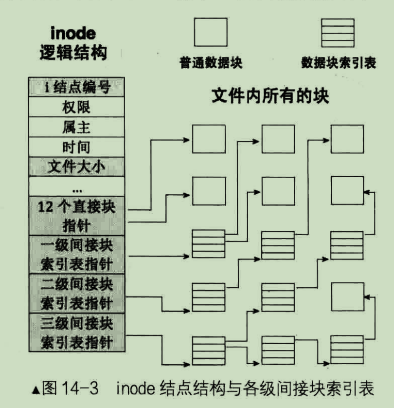
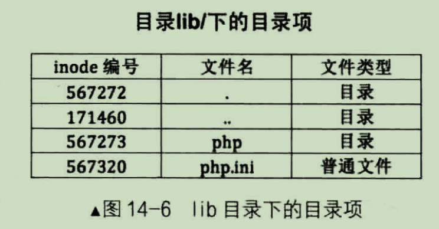
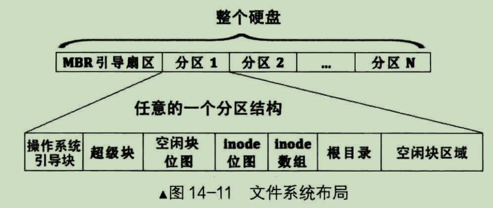
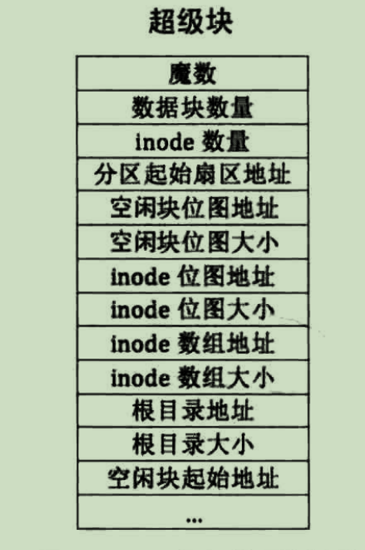

# 第14章 文件系统

该章的代码量不少，因为实现的功能不少，但是核心的知识点其实并不多，很多代码都是功能性的增强，有种回到了熟悉的
业务代码开发的感觉。 

核心知识点就一个就是文件在磁盘和内存中是怎么存储的，这个知识点可以细分为以下几个问题  
1、FAT文件格式是怎样的  
2、使用链式结构与索引结构组织文件的优缺点  
3、什么是indoe，indoe结构是怎样的  
4、怎么根据文件名在磁盘中找到我们要找的文件  


## FAT文件格式

FAT是windows上旧的文件格式，文件被分割成多个块，每块末尾会有个指针指向下一个块的地址，通过访问该地址就能找到下一个块。当要读取文件的时候
从第一个块一只访问到最后一个块即可。当然有地方记录文件名与第一个块的关联关系，这样就能找到第一个块。

因为这个只是引出后续的索引结构，所以简单了解即可。

## 链式结构与索引结构

上面提到FAT文件格式就是按链式结构组织的，和链表一样。这种方式的问题在于，每次只能从文件头开始读，无法从指定的位置开始读取，效率比较低。
linux则采用了按索引结构组织的方式来存储文件。所谓的索引结构，其实就是用数组记录每个块的起始位置，有多少块数组就有多长。该种方式的好处是
能够根据指定位置直接读取文件，缺点是文件越大，数据块越多的情况下，额外占用较多空间。


## inode

inode是linux仿unix实现的文件索引结构的一种数据结构，在linux中一个文件就有对应的一个indoe节点。inode结构如下图：



随书代码中的inode简化了，代码如下
```c

/* inode结构 */
struct inode {
    uint32_t i_no;    // inode编号

/* 当此inode是文件时,i_size是指文件大小,
若此inode是目录,i_size是指该目录下所有目录项大小之和*/
    uint32_t i_size;
    uint32_t i_open_cnts;   // 记录此文件被打开的次数
    bool write_deny;	   // 写文件不能并行,进程写文件前检查此标识

/* i_sectors[0-11]是直接块, i_sectors[12]用来存储一级间接块指针 */
    uint32_t i_sectors[13];
    struct list_elem inode_tag;
};

```

当文件很大的时候，数据块非常多，如果全放在一个索引表（inode中的i_sectors数组）中,索尼表就会非常大。
unix采取了折中的办法，inode中i_sectors数组固定为15，前12个元素存储的是数据块的地址，
后面的3个元素存储的是间接索引表的地址。这里数据块的地址指的是硬盘的lba地址，而不是内存地址。


例如：

第13个元素是存储的一级间接索引表的起始地址，该地址对应的又是一个数组的地址，该数组
存储了256个块的地址。此时文件共有 （ 12 + 256 ）* 4K 大小  


第14个元素存储的是二级索引表的地址，里面256个元素，每个元素存储的是一级索引表的地址，每个一级索引表又
存储了256个数据块的地址，此时文件共有 （12 + 256 + 256 * 256） * 4K 大小

第15个元素存储的是三级索引表的地址，原理和二级索引一样
此时文件共有 （12 + 256 + 256 * 256 + 256 * 256 * 256 ） * 4K 大小 = 64G 

当文件超过64G的时候，就要切割成多个文件了，因为inode最大只支持单个文件64G。


## 通过文件名查找

了解了inode之后，知道一个文件是怎么表示的了，那么很多文件呢？
答案是也有一个inode索引表，用来指向所有的inode，这样子就能找到所有的文件了。

我们平时说文件都会带上目录名的，例如/etc/hosts, 此时我们还需要知道目录的概念
在linux中，目录也是一种inode, 被称为目录文件，其结构与文件的inode的结构一样都是，一些属性，然后
有一个块的索引表，不同的是文件inode对应的块中存储的是文件的内容，而目录inode对应的块中存储的是目录的
内容。

以下是目录inode的结构  
  

只要我们找到目录的inode，解析它的块，就能找到对应文件inode编号，这个inode编号就是inode索引表中的
下标，根据下标我们就能得到文件inode的lba地址，最终就能读取文件了。


那么新的问题是，目录inode在哪？
无论是啥文件都必定属于某个目录的，在系统一开始必定存在一个叫根目录 `/` 的东西,
因为在安装操作系统之前需要先对磁盘进行分区，然后将系统安装在某个分区上。
每个分区都会对应有一个根目录，然后你创建的文件必定是落在某个分区的，也就是：  
文件A在分区1 ->  文件A肯定在分区1的根目录下  

那么根目录在哪里呢？
根目录是固定的，在inode表初始化时，就会将inode表的第一个元素初始化为 根目录


那么inode表在哪里呢？
inode表，通常是放在分区的前几个扇区中。在上一章的硬盘驱动，了解了分区、MBR、EBR这些概念，
每个分区的第一个扇区是用来放引导程序以及分区表的。 

书中以ext2文件系统来举例，前几个扇区的存放的内容如下:



那么到底inode数组在硬盘中的偏移量是多少呢？这就从超级块中解析了。
所谓的超级块，其实是文件系统的元数据，其中包含了inode数组的起始地址，inode数组的大小等等信息。
超级块的结构如下：  

按照书中的说法，其中的根目录起始地址就是inode数组的起始位置。

通过chatgpt，得知根目录块是inode表中的第二个元素，但这并不重要，重要的是我们这里只要知道怎么去找到根目录块即可。


