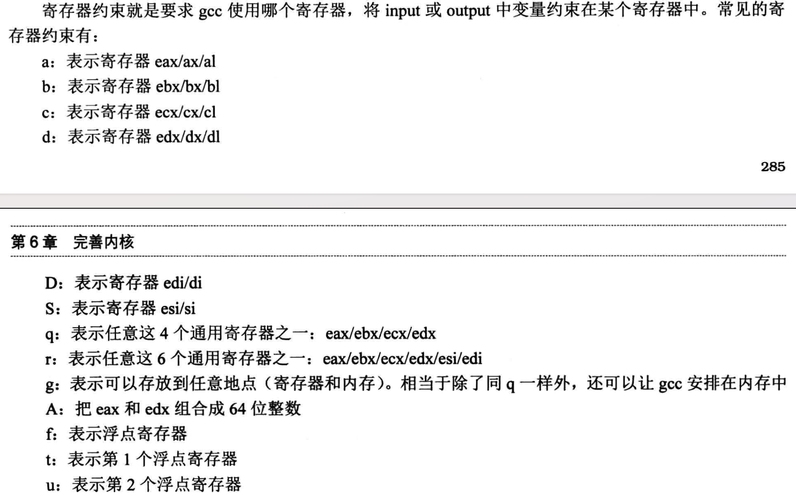

# 中断


该节增加了很多代码，程序运行成功会看到满屏的`interrupt occur!`，具体解释在8259A的编程小节中说明。

该节需要掌握的知识点  
1、中断是如何触发的  
2、中断描述符与中断描述符表长什么样子  
3、中断程序是什么样子的  
4、8259A的工作流程   
5、内联汇编以及 AT&T 语法  
6、如何通过编码使8259A工作  
7、代码中的一些知识点


# 中断是如何触发的


总之就是硬件发出的请求会被PIC设备接收到，然后CPU通过PIC设备（8295A就是中断设备的一种）得到了中断向量号之后，然后根据IDTR找到中段描述符表的位置，
计算找到中断向量号对应的中断描述符，也就是中断程序的起始地址跳转过去执行。执行完

# 中断描述符与中断描述符表


## 中断描述符符表

中断描述符表在C语言中其实就是一个数组，如下：
```c
/*中断门描述符结构体*/
struct gate_desc {
    uint16_t    func_offset_low_word;
    uint16_t    selector;
    uint8_t     dcount;   //此项为双字计数字段，是门描述符中的第4字节。此项固定值，不用考虑
    uint8_t     attribute;
    uint16_t    func_offset_high_word;
};

static struct gate_desc idt[IDT_DESC_CNT];   // idt是中断描述符表,本质上就是个中断门描述符数组
```
中断描述符表和全局描述符表一样的用法，都是通过寄存器存储表的起始地址，然后用过索引号
找到对应的中断描述符起始地址。不同的是，中断描述符中存储的是中断程序的起始地址。

## 中断描述符的结构

中断描述符的结构和全局描述符的结构差不多。 门其实就是一种描述符，中断描述符又叫门描述符吧，因为中断描述表中
存储的就是各种门的描述符。


# 中断程序
中断程序需要了解中断发生时的保护、寄存器压栈的情况以及中断错误码的处理


## 中断发生时的特权级保护

前面描述符结构的图中可以看到中断描述符中有两个特权级信息
1、DPL字段
2、中断处理程序目标代码段描述符选择子，其中有特权级信息


这里要区分是有软件发起的软中断还是硬件发起的中断。

软中断，需要检查发起中断的程序的CPL与中断描述符的DPL以及目标代码段的DPL比较
需要符合 权限大小如下： 中断描述符DPL <= CPL <= 目标代码段描述符DPL


硬中断，权限大小如下： 中断描述符DPL <= 目标代码段DPL


## 寄存器压栈

中断发生执行处理程序前，需要保存上下文环境，以便在中断程序执行完了之后返回。
这里分两种情况

1、有特权级转移的情况  


2、没有特权级转移的情况


# 8259A

8259A内容比较多，如果下面的图看不懂只能老老实实一点点看原文。

## 工作流程
要了解8259A的相关知识，通过结构图来记忆它的工作流程就比较容易记了
IMR -> IRR -> INT -> INTA -> PR -> ISR -> INTA 


## 8259A编程

这个8259A的编码，要记的东西好多，且属现在都用APIC不用8259A了，所以这部分代码知道在随书代码中是怎么写的就行了。

由于中断号0~19是CPU内部错误占用了，20~31是Intel保留的，所以我们可用的中断号为32 (0x20)。
设置主片的中断起始号为0x20,从片的起始号为0x28。

由于历史原因，x86硬件默认将0x20分配给时钟中断，因为时钟是每个系统都需要的。所以在随书代码中
将IMR设置为0xfe表示只接受最小的 0x20中断，也就是时钟中断。因此本节代码成功运行后，
会看到bochs模拟器界面中满屏的`interrupt occur!`.


# 内联汇编

## AT&T语法
之前一直用的intel语法，linux内核中一般都是AT&T语法，但无论用的是什么语法，在同一台机器上，编译出来的机器码都是一样的。
能看懂intel语法，也就很容易看懂AT&T语法，两者的差异如下：


## 内联汇编代码
```c
asm [volatile] ("assembly code")
```

volatile的作用是告诉 gcc，不要修改我写的汇编代码，请原样保留  
assembly code就是我们写的AT&T风格的汇编代码，可以写一条或者多条命令，也可以换行
如下：

单条命令
```c
asm volatile ("mov $1 %eax")
```

多条指令要用`;`号分隔
```c
asm volatile ("mov $1 %eax; mov %eax %ebx")
```

多行,必须要用`\`换行
```c 
asm volatile (" puasha; \
mov $1 %ebx; \
mov $2 %eax  ")
```

## 扩展内联汇编
扩展的原因是，内联汇编代码需要使用C语言中的变量、以及防止汇编代码把C语言使用了的寄存器的值覆盖掉。
扩展内联汇编中，寄存器不再是单个%前缀了，要用两个%%前缀,单个%号表示占位符。

扩展后内联汇编如下:
```c
asm [volatile] ("assembly code":output : input : clobbe/modify)
```

### output
output 用来指定汇编代码的数据如何输出给代码使用 ，格式如下
```text
"操作数修饰符约束名"(C变量名)
```
操作数修饰符一般为`=`号，约束名看后面的截图，示例：
```c
int in_a = 1, in b = 2, out_sum;
asm ("add! %%ebx, %%eax ":"＝a"(out_sum):"a"(in_a),"b"(in_b));
```

add指令，将C语言的变量 in_a、in_b想加，结果输出到变量 out_sum中
in_a用eax寄存器存放, in_b用寄存器ebx存放。 a、b就是约束名，对应的寄存器要看下面的截图
### input
input 用来指定C语言中的数据如何输入给汇编使用，格式如下：
```text
"[操作数修饰符］约束名"(变量名）
```
示例看output处

### clobbe/modify
clobber/modify ：汇编代码执行后会破坏一些内存或寄存器资源，通过此项通知编译器，可能造成寄
存器或内存数据的破坏，这样 gcc 就知道哪些寄存器或内存需要提前保护起来。

这里主要是针对那些用汇编调用函数的情况下，gcc无法看到实际修改了哪些寄存器，除了input、output中给出的
还修改了的寄存器在这里写。

```c
asm ("movl %%eax, %0 ;movl %%eax,%%ebx":"=m"(ret_value)::"bx")
```


### 寄存器约束



除了寄存器约束还有占位符约束、名称约束、内存约束等等，要用到再查


# 代码知识点

## 中断程序的地址

在`interrupt.c`中，通过extern关键字引用了`kernel.asm`中gobal标号作为中断程序的地址传递给了make_idt_desc函数构建中段描述符
```c
extern intr_handler intr_entry_table[IDT_DESC_CNT];	    // 声明引用定义在kernel.S中的中断处理函数入口数组
```
其中`intr_handler` 是 `void*` 类型, 指针类型在32位系统中占用4个字节。

再看`kernel.asm`中`intr_entry_table`的定义如下
```nasm
section .data
intr_str db "interrupt occur!", 0xa, 0
global intr_entry_table
intr_entry_table:

%macro VECTOR 2
section .text
intr%1entry:		 ; 每个中断处理程序都要压入中断向量号,所以一个中断类型一个中断处理程序，自己知道自己的中断向量号是多少
%2
push intr_str
call put_str
add esp,4			 ; 跳过参数

; 如果是从片上进入的中断,除了往从片上发送EOI外,还要往主片上发送EOI
mov al,0x20                   ; 中断结束命令EOI
out 0xa0,al                   ; 向从片发送
out 0x20,al                   ; 向主片发送

add esp,4			 ; 跨过error_code
iret				 ; 从中断返回,32位下等同指令iretd

section .data
dd    intr%1entry	 ; 存储各个中断入口程序的地址，形成intr_entry_table数组
%endmacro

VECTOR 0x00,ZERO
```
使用了宏，会在编译器预处理的时候，替换成真正的代码。因为`intr_entry_table`
看起来并不像一个连续存放了多个4个字节的数组啊？因为在宏代码中有.text和.data两个section
nasm编译器会在编译后会将.data合并在一起。可以通过查看编译后输出的elf文件头信息查看
```shell
nasm -f elf32 kernel.asm -o kernel.o
readelf -S kernel.o
```

此时可以看到只有一个.data的section,大小为96个字节
```shell
Section Headers:
  [Nr] Name              Type            Addr     Off    Size   ES Flg Lk Inf Al
  [ 0]                   NULL            00000000 000000 000000 00      0   0  0
  [ 1] .data             PROGBITS        00000000 000180 000096 00  WA  0   0  4
  [ 2] .text             PROGBITS        00000000 000220 00032e 00  AX  0   0 16
  [ 3] .shstrtab         STRTAB          00000000 000550 00003b 00      0   0  1
  [ 4] .symtab           SYMTAB          00000000 000590 000280 10      5  38  4
  [ 5] .strtab           STRTAB          00000000 000810 0001fc 00      0   0  1
  [ 6] .rel.data         REL             00000000 000a10 000108 08      4   1  4
  [ 7] .rel.text         REL             00000000 000b20 000210 08      4   2  4
```

这里就有问题了，因为定了32个中断程序,自然就写了32个地址，占用了32*4=128个字节，这与96个字节不符合
这里一时半会搞不定，以后找到了答案再回来补充。


