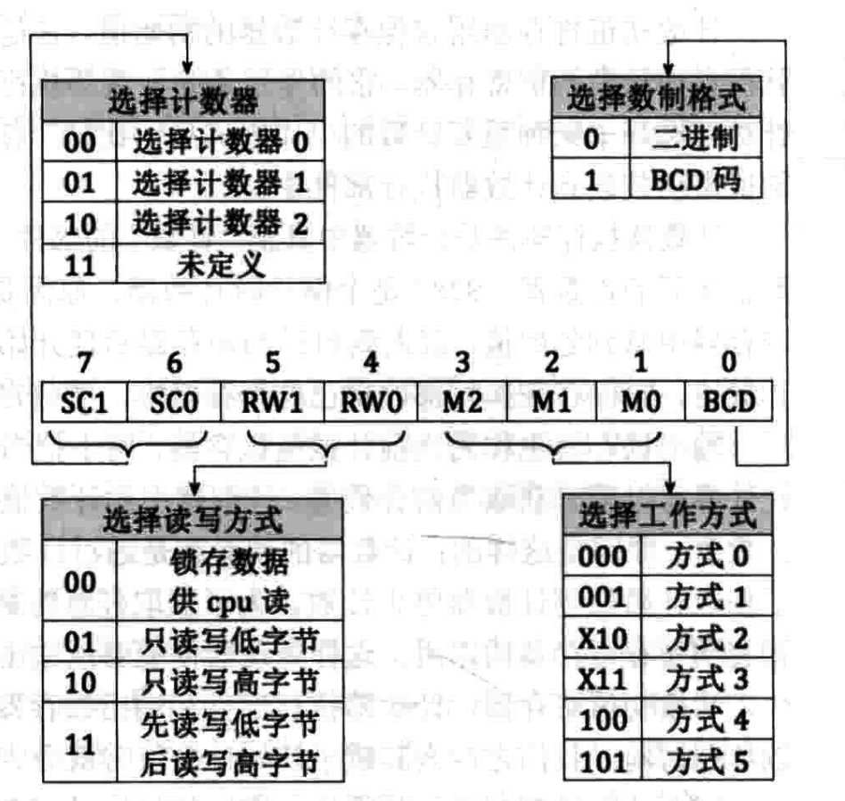

# 知识点
1、汇编中调用C语言函数
2、从汇编的角度理解static函数
3、8253编程


# 1、汇编中调用C语言函数

c代码 interrupt.c 中定义变量,声明了一个函数数组
```c
intr_handler idt_table[IDT_DESC_CNT];
```
然后在 kernel.asm中使用关键字 `extern `声明C语言中的变量

```c
extern idt_table		 ;idt_table是C中注册的中断处理程序数组
call [idt_table + 1*4]       ; 调用idt_table中第2个中断处理函数

```


# 2、从汇编的角度理解static函数  
在汇编级别，函数（无论是否声明为static）本质上都是一段可执行的指令序列。
汇编语言并不直接支持static这样的高级别概念。static的作用主要体现在编译和链接过程中，
它决定了符号（Symbol）的可见性和链接方式。

## 符号可见性和链接  

- 非静态函数：在编译后生成的目标文件（.o或.obj文件）中，非静态函数的名称被导出为外部符号（External Symbol），
这意味着链接器（Linker）在处理多个目标文件生成最终的可执行文件时，可以识别和链接到这个函数的实现。

- 静态函数：对于static函数，编译器在转换为汇编代码时作为局部符号（Local Symbol）处理。这样，
即使其他文件中有相同名称的函数，链接器也不会引起冲突，因为它仅在本文件的上下文中可见。

## 汇编和符号命名
- 非静态函数
通常直接使用其名称作为标签（Label），这个标签对应于函数实现的开始位置。

- 静态函数
可能有一些特殊的命名方式来确保其在内部的唯一性，比如在其名称前添加静态标识或文件特定的前缀。这取决于编译器的具体实现。


# 8253
第7章中断示例中的中断向量号为0x20的时钟中断就是由该定时器触发的。 8253是可编程的定时器，
在后续第8章中需要通过定时触发时钟中断来调度线程，因此这里需要熟悉8253的工作原理以及编码。


## 初始化

8253定时器中，有3个独立的计数器，我们只用计数器0


3个独立计数器的初始和其他硬件一样通过固定的端口设置硬件的工作方式，然后再从固定的端口进行
读取或者写入数据。 8253的初始步骤如下：  
1. 往0x43端口设置控制模式，控制模式包括该计数器工作时采用的工作方式、读写格
式及数制。
2. 在所指定使用的计数器端口中写入计数初值,计数器0的端口为0x40


### 那么往0x43里写入什么呢？
Ox43端口是一个8位大小的寄存器


随书代码中，0x43写入值如下
计数器0，对应SC1~SC0是 00
读写方式，对应rw1~rw0 是 11
工作方式，对应M2~M0 是 010
进制，对应BCD 是 0


### 0x40写入初始值如何计算？*  
