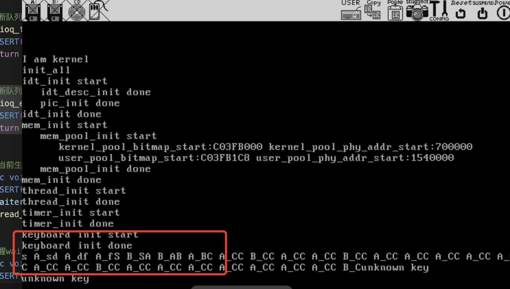
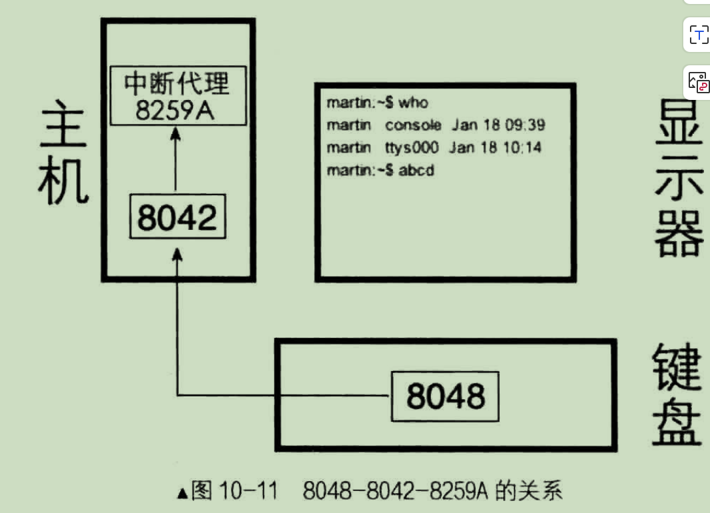
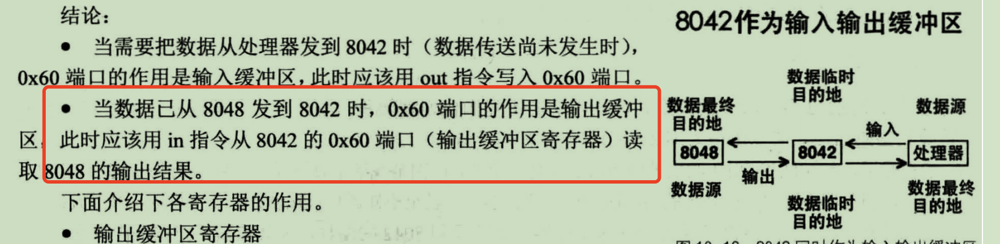

# 键盘驱动

书的第10章节，代码运行效果如下


启用了键盘中断、时钟中断。启动bochs后，键盘上按下按键会往缓冲区中存储按下的字符
然后在main方法中启动两个线程作为消费者，不断的从缓冲区中读取字符，并加上前缀打印到
屏幕上。


## 从键盘获取输入原理




> 无论是按下键，或是松开键，当键的状态改变后，键盘中的 8048 芯片把按键对应的扫描码（通码或断码）
发送到主板上的 8042 芯片，由 8042 处理后保存在自己的寄存器中，然后向 8259A 发送中断信号，这样处理
器便去执行键盘中断处理程序，将 8042 处理过的扫描码从它的寄存器中读取出来，继续进行下一步处理。


什么时候会触发中断？
> 为了让我们获取击键的过程，在每一次击键动作的“按下”、“按下保持”和“弹起”三个阶段，确切地说
是每次 8042 发扫描码的时候， 8042 都会向中断代理（咱们是 8259A ）发一次中断，即“键被按下”
时发中断，“持续按着不松手”时会持续发中断，“松开手，键被弹起”时也发中断，因此，我们的键盘中断处
理程序每次都会随着键盘发出的扫描码而去执行，也就是也会收到完整的击键过程，包括键的持续按压状态。


## 扫描码

为什么有有3套这么多扫描码？
> 早期键盘上的键不多，因此扫描码规模也小，旧扫描码的编码方法足够应对。后来计算机逐渐发展，
键盘上支持的功能键就多了，于是原有的编码方法使得扫描码的处理变得不再高效，因此要跟着扩充、更新或者重新来一套新的，于是便有了新的键盘扫描码。


**这么多套扫描码，那么我们用哪套？**

>扫描码有3套，现在一般键盘中的 8048 芯片支持的是第 2 套扫描码 因此每当有击键发生时， 8048
发给 8042 的都是第二套键盘扫描码。8042 为了兼容性，将接收到的第 2 套键盘扫描码转换成第 1 套扫描码。 8042是按字节来处理的，
每处理 1 个字节的扫描码后，将其存储到自己的输出缓冲区寄存器。然后 8042 向中断代理 8059A 发中断信号，
这样我们的键盘中断处理程序通过读取 8042 的输出缓冲区 寄存器，会获得第 1 套键盘扫描码。


### 扫描码编程

第一套键盘扫描码的通码和断码可以这样理解:  
> 它们都是一字节大小，最高位也就是第7位的值决定按键的状态，值为0，表示按键处于按下的状态，否则为1的话，表示按键弹起。


为什么有些通码和断码是几个字节的？
>有些按键的通码和断码都以 OxeO 开头，它们占2个节，甚至 Pause 键以 Oxe1 开头，占6个字节
原因是这样的，并不是一种键盘就要用一套键盘扫描码，最初第一套键盘扫描码是由 XT 键盘所使
用的，它后来也被一些更新的键盘所使用。XT键盘上的键很少，比如右边回车键附近就没有 alt ctr 键，这
是在后来的键盘中才加进去的，因此表示扩展 extend ，所以在扫描码前面加了 OxeO 作为前缀。


获取扫描码


目前键盘驱动中只用了从0x60端口读取扫描码

然后其余需要记的就是，通码和断码的转换。
```text
单字节的通码 | 0x80  ->  断码
断码 & 0x7f -> 通码
```
只需要改变最高即可
