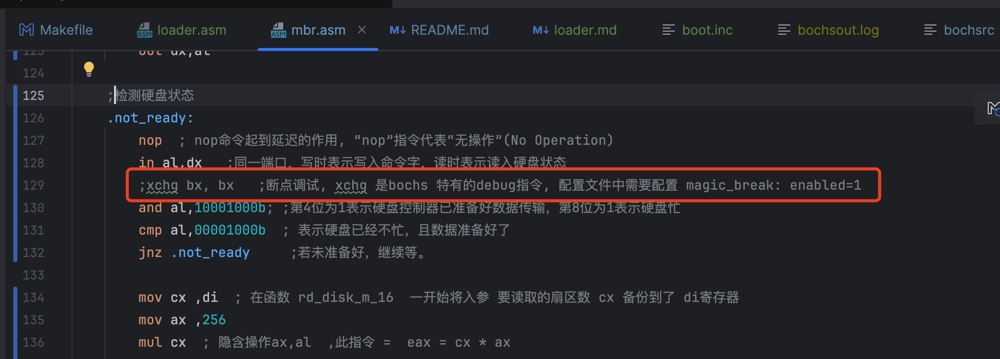
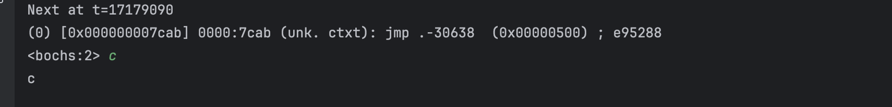
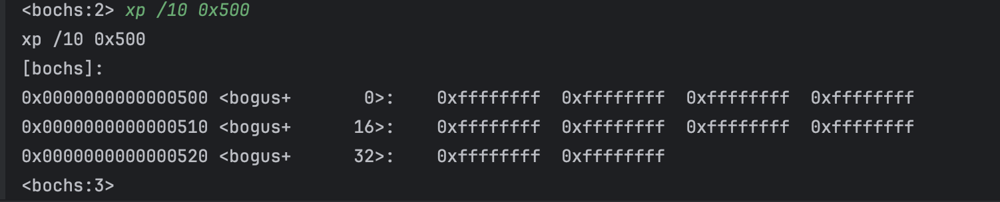
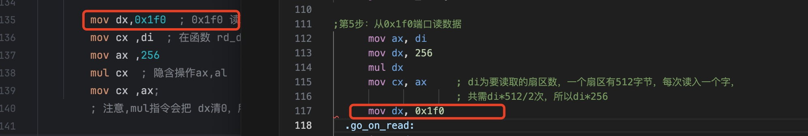

# 说明
此文档中的笔记是在写《操作系统真象还原》第3章-完善MBR 对应的代码时遇到的问题的记录

# 遇到的问题
## 无法跳转到loader的代码上执行

编写完mbr.asm以及loader.s后，运行期望的效果是，原本屏幕输出的 "hello word" 会被替换成 "loader".但实际运行效果是
仍旧是"hello word"


### 通过断点debug查看

bochs配置文件中增加以下选项
```bash
# 启用debug功能,需要编译源码的方式安装bochs
magic_break: enabled=1
```
然后在汇编代码中使用xchg bx,bx指令即可让bochs运行到该指令时进入调试模式


进入调试模式后，一步步运行代码发现到 jmp跳转到 loader的位置就会一直卡着，没有执行loader的代码
```asm
call rd_disk_m_16		 ; 以下读取程序的起始部分（一个扇区）
xchg bx, bx
jmp LOADER_BASE_ADDR
```


### 使用xp命令查看0x500内存

怀疑是跳转后的指令有问题，怀疑是读磁盘读出来的数据不对，导致跳转后的内容有问题



发现内存地址为0x500的数据全是ffff,这明显是有问题，那么就是从磁盘读取数据就出问题了
使用xchg指令debug,发现读出来的内容确实是ffff。

此时把代码替换成《操作系统真象还原》配套的源码，发现读取的内容是没有问题的，对比我自己写的代码发现区别在于


然后断点查看寄存器的值，发现读取数据的时候，我代码中的dx寄存器的值会在mul指令执行后清零。

