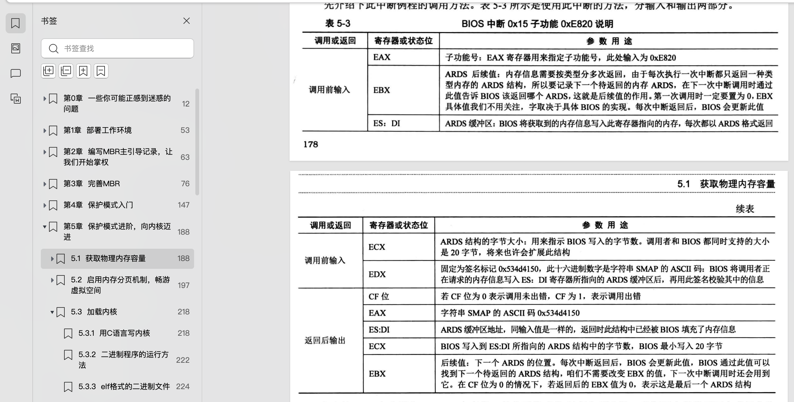

# 物理内存检测


## BIOS中断检测物理内存
通过BIOS中断0x15的3个子功能获取物理内存大小：
- 0xE820
- 0xE801
- 0x88

由于BIOS是实模式下才能用的，因此需要在进入保护模式前使用。这里只实现0xE820就可以了，0xE801、0x88功能没有0xE820强，且新的机器只会更强。。。


### 0xE820

出入参如下：


0xe820是分多次返回查询结果的，一次只返回一个地址范围描述符（ Address Range Descriptor Structure, ARDS ）
第一次查询时，ebx的入参值要为0. 代用0xe820后，会更新改该值为下一个返回的ARDS的值。
示例代码如下：


```asm
;-------  int 15h eax = 0000E820h ,edx = 534D4150h ('SMAP') 获取内存布局  -------
        xor ebx, ebx		      ;第一次调用时，ebx值要为0,  自己与自己进行异或操作结果为0
        mov edx, 0x534d4150	      ;edx只赋值一次，循环体中不会改变，固定值
        mov di, ards_buf	      ;ards结构缓冲区
        .e820_mem_get_loop:	      ;循环获取每个ARDS内存范围描述结构
            mov eax, 0x0000e820	      ;执行int 0x15后,eax值变为0x534d4150,所以每次执行int前都要更新为子功能号。
            mov ecx, 20		      ;ARDS地址范围描述符结构大小是20字节
            int 0x15
            jc .e820_failed_so_try_e801   ;若cf位为1则有错误发生，尝试0xe801子功能
            add di, cx		      ;使di增加20字节指向缓冲区中新的ARDS结构位置
            inc word [ards_nr]	      ;记录ARDS数量
            cmp ebx, 0		      ;若ebx为0且cf不为1,这说明ards全部返回，当前已是最后一个
            jnz .e820_mem_get_loop
```

### ARDS结构


## 代码说明


### total_mem_bytes内存中的地址是0xb00

随书代码中loader起始地址是0x900,加上下图中的字节数 0x200（ 512个字节 = 64个GDT描述符 * 8个字节 ）


我的loader程序起始地址为0x500,且在loader程序初有一个跳转指令
```asm
; 此处必须要跳转到 标号为loader_start处,因为从MBR过来后,cs:ip指向的是GDT_BASE,不是我们要执行的指令
    jmp loader_start
```
通过在jmp指令前加入xchg指令令bochs进入debug模式查看内存可以看到，jmp指令 e9ff02占用3个字节
```bash
u /2 0x500
0000000000000500: (                    ): xchg bx, bx               ; 87db
0000000000000502: (                    ): jmp .+767  (0x00000804)   ; e9ff02
```
因此，我total_mem_bytes 所在内存地址是
0x500 + 0x3 + 0x200

这个地址计算出来是为了方便通过debug模式来查看代码能否正常获取内存大小。
```asm
<bochs:9> xp 0x703
xp 0x703
[bochs]:
0x0000000000000703 <bogus+       0>:	0x04000000
```
0x4000000 是字节数，转换成10进制是 64mb


