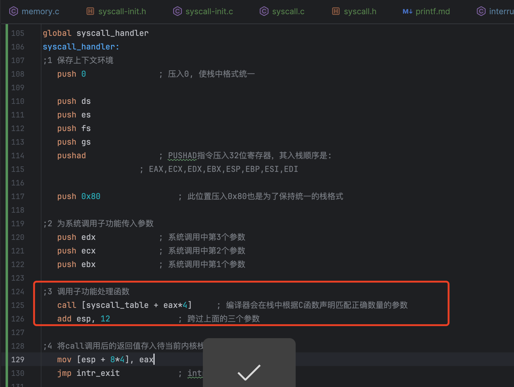

# 第12章完善内核

## 本章工作

主要是从这3个点展开工作
1. 实现用户进程使用的printf方法
2. 堆内存的管理 
- 实现用户进程使用的分配内存的malloc方法
- 实现用户进程使用的回收内存的free方法


## 1、实现用户进程使用的printf方法

printf小节的知识点主要是以下内容:
1. 系统调用`int 0x80`
2. printf函数的可变参数原理

### 1.1 int 0x80

为了系统的安全与稳定，用户进程并不能直接调用操作系统的内部方法，只能调用系统提供的功能。调用的方法是通过中断的方式。
通过`int`汇编指令，触发软中断，然后由中断程序调用指定的函数。
linux系统中，通常将中断号为`0x80`作为系统调用的入口.

调用的实际流程如下：

以系统调用`getpid`为例说明  
用户程序调用C库中`getpid`函数,在其代码最后实际是使用了内联汇编代码如下：
```c
/* 无参数的系统调用 */
#define _syscall0(NUMBER) ({				       \
   int retval;					               \
   asm volatile (					       \
   "int $0x80"						       \
   : "=a" (retval)					       \
   : "a" (NUMBER)					       \
   : "memory"						       \
   );							       \
   retval;						       \
})


/* 返回当前任务pid */
uint32_t getpid() {
return _syscall0(SYS_GETPID);
}
```
此时代码会跳转到中断向量号为`0x80`对应的中断程序中，在中断程序中，又会根据入参的值`SYS_GETPID`会调用对应的功能函数来工作。
`SYS_GETPID`是一个枚举变量，起始就是一个数字。


`syscall_table`是C语言中定义的一个指针数组,每个元素都是指向一个函数，eax就是我们传递的枚举变量`SYS_GETPID`，其对应的数值为0,则
eax*4 = 0 ,所以 `call ...`就会跳转到对应的函数执行。
```c
/* 返回当前任务的pid */
uint32_t sys_getpid(void) {
    return running_thread()->pid;
}


/* 初始化系统调用 */
void syscall_init(void) {
    put_str("syscall_init start\n");
    syscall_table[SYS_GETPID] = sys_getpid;
    syscall_table[SYS_WRITE] = sys_write;
    syscall_table[SYS_MALLOC] = sys_malloc;
    syscall_table[SYS_FREE] = sys_free;
    put_str("syscall_init done\n");
}

```


### 1.2 参数和返回值的传递
无论是C语言和汇编，最终传递参数最终无非就是两种，要么是寄存器传参、要么是栈传参。书中作者提供了两种版本的实现。
寄存器传参的好处是，参数值是在寄存器中的，而栈是在内存中的，CPU可以直接访问寄存器取值，而不需要从内存加载参数值到寄存器。

#### 1.2.1 本章代码参数传递的流程
本章的代码中，调用系统提供的printf等函数的时候，最终是用内联汇编调用`int 0x80`。在内联汇编中指定了传参用的寄存器分别，
```c

/* 三个参数的系统调用 */
#define _syscall3(NUMBER, ARG1, ARG2, ARG3) ({		       \
   int retval;						       \
   asm volatile (					       \
      "int $0x80"					       \
      : "=a" (retval)					       \
      : "a" (NUMBER), "b" (ARG1), "c" (ARG2), "d" (ARG3)       \
      : "memory"					       \
   );							       \
   retval;						       \
})
```

然后在0x80对应的中断程序中,把可能用来传参的寄存器都压入了栈中。如下的edx,ecx,ebx。
eax则是在前面的pushad指令中已经入栈了。
```asm
   pushad			    ; PUSHAD指令压入32位寄存器，其入栈顺序是:
				    ; EAX,ECX,EDX,EBX,ESP,EBP,ESI,EDI

   push 0x80			    ; 此位置压入0x80也是为了保持统一的栈格式

;2 为系统调用子功能传入参数
   push edx			    ; 系统调用中第3个参数
   push ecx			    ; 系统调用中第2个参数
   push ebx			    ; 系统调用中第1个参数

;3 调用子功能处理函数
   call [syscall_table + eax*4]	    ; 编译器会在栈中根据C函数声明匹配正确数量的参数
   add esp, 12			    ; 跨过上面的三个参数
```

为什么是edx,ecx,ebx，如果我函数只有一个参数呢？
因为在x86环境中，c默认使用的是cdecl的调用约定，参数从右往左入栈。在C代码转换的汇编中也会根据esp中取出对应的参数值使用。
如果你参数只有一个入参的时候，C代码转换的汇编代码也只会取到ebx的值，并不会取ecx,edx。此时ecx,edx是没有用的。
之所以会把这3个寄存器的值都入栈，这样子，无论是0、1、2、3个入参的函数都能共用这个中断程序了。


### 1.3 可变参数

```c

#define va_start(ap, v) ap = (va_list)&v  // 把ap指向第一个固定参数v
#define va_arg(ap, t) *((t*)(ap += 4))	  // ap指向下一个参数并返回其值
#define va_end(ap) ap = NULL		  // 清除ap


/* 格式化输出字符串format */
uint32_t printf(const char* format, ...) {
    va_list args;
    va_start(args, format);	       // 使args指向format
    char buf[1024] = {0};	       // 用于存储拼接后的字符串
    vsprintf(buf, format, args);
    va_end(args);
    return write(buf);
}

```

如上代码所示，函数的定义中，参数是直接用`...`代替的，C语言解析器会
自动识别调用处的代码传了多少个值，然后入栈。

使用`...`的问题在于在函数内就不能直接用变量名去使用入参了，那么怎么获取入参呢？
答案是通过指针，va_start将指针args指向了format，而cdecl调用约定规定，其后面的参数
都在format的上面（x86中，栈向下扩展）。

因为format是字符串指针，所以栈中是一个4个字节的数值，因此可以通过对 args += 4 获取栈中format后一个参数在栈中的起始地址（x86中，栈向下扩展，向上增长）

获取到起始地址后，接下来就是对各个参数的解析了。printf中，我怎么知道我参数是字符串呢，还是整形，还是1个字节的byte呢？
答案是函数它自己知道，因为`...`是你定义的，你传了什么你自己知道，因此在
函数体内，你要按照规则去解析，也就是第一个参数是整形，你就取4个字节转整形；
是字符串，你就取地址值，遍历直到遇到`\0`.  

在printf中，是根据format字符串中的%，有几个%号就有几个入参，参数的类型就根据
%后面的字符
```c
switch(index_char) {
            case 's':
                arg_str = va_arg(ap, char*);
                strcpy(buf_ptr, arg_str);
                buf_ptr += strlen(arg_str);
                index_char = *(++index_ptr);
                break;

            case 'c':
                *(buf_ptr++) = va_arg(ap, char);
                index_char = *(++index_ptr);
                break;

            case 'd':
                arg_int = va_arg(ap, int);
                /* 若是负数, 将其转为正数后,再正数前面输出个负号'-'. */
                if (arg_int < 0) {
                    arg_int = 0 - arg_int;
                    *buf_ptr++ = '-';
                }
                itoa(arg_int, &buf_ptr, 10);
                index_char = *(++index_ptr);
                break;

            case 'x':
                arg_int = va_arg(ap, int);
                itoa(arg_int, &buf_ptr, 16);
                index_char = *(++index_ptr); // 跳过格式字符并更新index_char
                break;
```


最后，函数不能定义成如下形式
```c
uint32_t printf(...) 
```
不能只有一个可变参数，原因就是需要有一个参数来定位到可变参数，例如printf中的format!!


## 2. 堆内存的管理
所谓管理其实就是块的分配与回收，要弄清楚分配与回收要先熟悉一下内存块相关的基础概念以及相关的数据结构。

### 2.1 基础概念
在前面的章节中，实现了按页分配内存，但是无法满足小块内存的分配需求。例如我只需要
32个字节的时候，你给我分了一页，我用不完，就浪费了。 malloc是根据入参值进行内存分配，
需要多少就分配多少。

这里有两个新的概念，arena、mem_block以及。arena、mem_block都是一种逻辑概念，在代码中
是一种数据结构，用来实现内存按需分配的。

arena在随书代码中，其实就是一个或者多个页，只不过其中存储了一些元数据。这些元数据，
表示该arena中的block的大小以及有哪些block可以用。每一个arena中只能有一种规格block。
创建代码如下：
```c
struct arena* a;
a = malloc_page(PF, page_cnt);
memset(a, 0, page_cnt * PG_SIZE);	 // 将分配的内存清0
/* 对于分配的大块页框,将desc置为NULL, cnt置为页框数,large置为true */
a->desc = NULL;
a->cnt = page_cnt;
```

arena结构体定义如下
```c
/* 内存仓库arena元信息 */
struct arena {
    struct mem_block_desc* desc;	 // 此arena关联的mem_block_desc
    /* large为ture时,cnt表示的是页框数。
    * 否则cnt表示空闲mem_block数量 */      
    uint32_t cnt;
    bool large;
};

```
arena中有个成员变量是mem_block_desc, 内存块描述符，块的大小以及有哪些块可用就在这个描述符中。   
```c

/* 内存块描述符 */
struct mem_block_desc {
uint32_t block_size;		 // 内存块大小
uint32_t blocks_per_arena;	 // 本arena中可容纳此mem_block的数量.
struct list free_list;	 // 目前可用的mem_block链表
};
```

block的大小是规定好的，只有几种固定的几种规格。内存块规格大小是以2为底的指数方程来设计的，从 16 字节起，
分别是 16、32、64、128、256、512、1024宇节，共有7种规格的内存块。 至于大于1024字节的，
直接分配页，因为大于1024字节的时候，只能分配2048字节，扣除元数据开销后，一个页只能存储一个块，有点脱裤子放屁的效果。


### 2.2 内存块的分配与回收

#### 2.2.1 内存块分配
初看arena有种池的感觉，就是创建好内存块池，然后需要了我就给你从里面取一个出来。
但是内存块并不是这样的，而是第一次申请的才会创建，但又因为一个arena分配的时候，最小也是一个页大小，因此会有剩余的
block，下次申请的时候就是直接取出来了。

无论是页的分配，还是block的分配，返回的都是一个内存地址，具体怎么用是申请方要考虑的事情。这里要注意的是
申请内存小于1024字节的时候，返回的是block，其地址直接返回即可，大于1024字节的时候，
```c
return (void*)(a + 1);		 // 跨过arena大小，把剩下的内存返回
```
a是`struct arena*`,其+1运算等同于 `+ sizeof(struct arena)` 跳过了arena的大小，返回的是可用的内存地址。


下面是block大小 <1024字节的情况，大于1024字节的，直接就是页了，不需要在额外的划分block了。

```c
struct arena* a;
struct mem_block* b;

a = malloc_page(PF, 1);       // 分配1页框做为arena
if (a == NULL) {
    lock_release(&mem_pool->lock);
    return NULL;
}
memset(a, 0, PG_SIZE);

/* 对于分配的小块内存,将desc置为相应内存块描述符,
 * cnt置为此arena可用的内存块数,large置为false */
a->desc = &descs[desc_idx];
a->large = false;
a->cnt = descs[desc_idx].blocks_per_arena;
uint32_t block_idx;

enum intr_status old_status = intr_disable();

/* 开始将arena拆分成内存块,并添加到内存块描述符的free_list中 */
for (block_idx = 0; block_idx < descs[desc_idx].blocks_per_arena; block_idx++) {
    b = arena2block(a, block_idx);
    ASSERT(!elem_find(&a->desc->free_list, &b->free_elem));
    list_append(&a->desc->free_list, &b->free_elem);
}
intr_set_status(old_status);
```

划分好的block会放入描述符的队列中,`list_append`入参是指针，而 `b->free_elem` 返回的是解指针后
的值，所以要 `&`重新转换成指针。
```c
/* 内存块 */
struct mem_block {
    struct list_elem free_elem;
};

/* 内存块描述符 */
struct mem_block_desc {
    uint32_t block_size;		 // 内存块大小
    uint32_t blocks_per_arena;	 // 本arena中可容纳此mem_block的数量.
    struct list free_list;	 // 目前可用的mem_block链表
};
```
这里让我不好理解的是list_elem定义如下,把这个东西加入描述符的list中就能代表block了？
```c
struct list_elem {
    struct list_elem* prev; // 前躯结点
    struct list_elem* next; // 后继结点
};
```
结构体list_elem的成员变量是`list_elem*`,有种套娃的感觉，并没有看出list_elem到底是什么东西，但是不重要
重要的是他是list_elem类型的成员变量。

因为我们在描述符中使用的是list对象来记录有哪些空闲的block，那么就要用list能够接受的数据类型来加入list中。
因此mem_block的成员变量是一个list_elem类型的变量。他的值是什么并不重要，只要能放入list中即可。
当我们要获取block的时候，只要利用偏移量计算得到mem_block的地址即可。elem2entry如下就能得到
mem_block的地址。
```c
/* 开始分配内存块 */
b = elem2entry(struct mem_block, free_elem, list_pop(&(descs[desc_idx].free_list)));
memset(b, 0, descs[desc_idx].block_size);
```


#### 2.2.2 内存的回收

要对内存进行回收，则要将分配内存的时候的动作全部逆转一下即可。那么分配内存的时候，
我们又做了哪些工作呢？

1. 分配page（更新物理内存池bitmap、虚拟内存池bitmap、新增页表项）
2. 初始化arena,block加入list中
3. 从list移除block，返回地址给申请方

因此回收内存则需要：

1. 根据地址将block放入list中
2. 回收arena (更新arena中信息)
3. 回收page (更新物理内存池bitmap、虚拟内存池bitmap、移除页表项)

上述的环节逻辑都很清晰，我个人觉得有必要的两个点要记录下的
1. 页表项的移除为什么更新P位就可以了
2. 块描述符存在哪里？


页表项移除的时候，至少也是page级别的回收，因为arena中还有不少块呢，只有当所有块都没人用的
时候才会回收。

正常情况下page回收了，是要移除页表项中的项的，但是随书代码中并没有这么做，只是
将页表项对应的P位置为0。当访问对应内存地址时，让CPU触发`page fault`异常。如果是完整的系统的情况下，
触发了pagefault异常会进入pagefault中断处理程序，将页加载到内存中，然后pagefault中断程序
返回再一次访问内存地址，继续原有流程。 这里并没有实现pagefault中断处理程序，因此如果访问了已经回收的地址
会报pagefault中断异常，从而确保我们已经回收了内存。

如果其他地方申请内存的时候，因为内存池的bitmap中已经更新回去了，就能分配到该内存地址，
分配page的时候，会重新覆盖掉旧的pte项，因此内存等同于回收掉了。


块的描述符是一个数组的形式出现的，定义在PCB的结构体中，内核线程则共用同一个块描述符数组，
用户进程则自己独立一个。我的理解是，内核线程其实就是操作系统用的，操作系统是一个整体
所以共用，而用户进程则不是，用户进程需要互相独立，没道理我申请的内存，你能过来插一脚。
因此才有了这样的设计。


