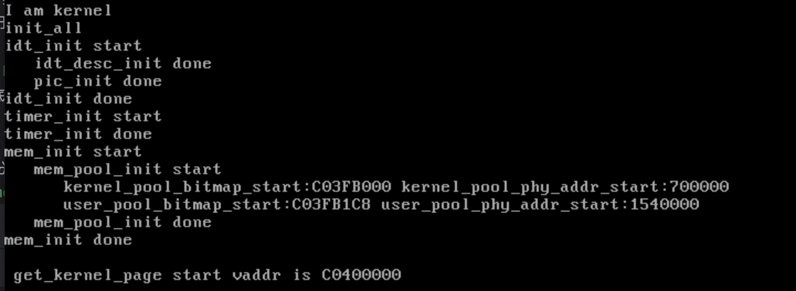
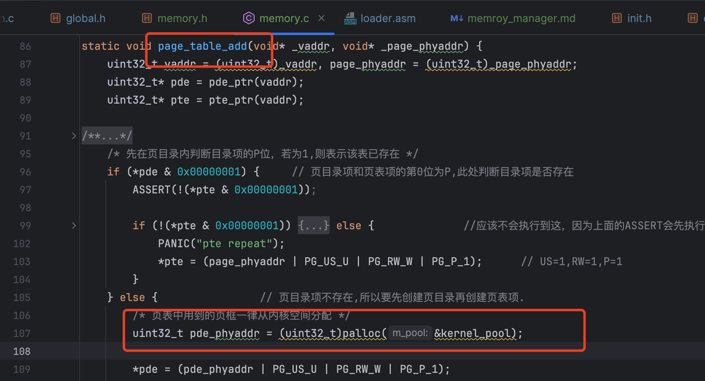

# 内存管理模块

整个内存管理模块章节，也就是第8章代码完成后，运行效果如下：


这部分的内容有点多，看的时候，需要铺垫的东西太多了，看得我很难受。还是从代码的角度去
理解会比较顺畅些。

1. 程序在运行的过程中，会有额外申请和释放内存的动作，例如调用malloc以及free函数来申请和释放内存。
书中代码实现了按页为单位分配内存的函数`get_kernel_pages`，并`main.c`中演示了使用。该章节还没有实现malloc、free等函数
,应该是在后续章节中实现。

2. 为了保证内核能够正常运行，作者将内核使用的内存与用户进程使用的内存划分成了内核内存池、用户内存池。
作者简单的将内存对半分，一半用于内核，一半用于用户进程。内存池的初始化在`init_all`函数中。

3. 为了管理内存的使用的情况，内存池中需要用`bitmap`这种数据结构，因此书中有不少篇幅是对bitmap的代码说明。
在对bitmap的操作函数中，会使用到字符串操作底层实现的几个内存操作函数，例如`memset`,`memcmp`,`memcpy`
因此需要完成`string.c`的实现。

4. 由于内核是运行在分页机制下的，还需要实现分配到的物理内存与虚拟地址进行映射，也就是构建
页目录项、页表等。 建立pde、pte具体逻辑在`memory.c`的`page_table_add`中。因为需要分配虚拟地址，因此也需要虚拟内存池来管理虚拟内存。


下面是我整理的内存管理模块中一些自己不好理解的知识点：


## bitmap实现内存管理
位图（Bitmap）是一种数据结构，用于表示和管理内存块的使用情况。每一位（bit）通常表示一个固定大小的内存块（如一页）。

```c
struct bitmap {
    uint32_t btmp_bytes_len;
/* 在遍历位图时,整体上以字节为单位,细节上是以位为单位,所以此处位图的指针必须是单字节 */
    uint8_t* bits;
};
```
随书代码的位图结构如上


### bitmap使用方法
假设我们有32MB的内存，并将其分成4KB的块：
```text
内存块数 = 32MB / 4KB = 8192块  
位图大小 = 8192位 = 1024字节（因为1字节 = 8位）
初始化位图时，所有位设置为0，表示所有内存块都是空闲的。
```
当需要分配或者释放内存时，无论是虚拟内存还是物理内存的分配其实就是遍历bitmap中的bit位，
找到空闲的bit位，将其置为1，然后根据起始地址 + bit位的索引 计算实际的地址。

示例如下：

假设内存共32mb,现使用bitmap代表物理地址的高16mb的内存，起始位置是0x1000000，结束位置是0x2000000.
那么 bitmap初始化如下
```
struct bitmap pool；
pool->btmp_bytes_len = 512;
pool->bits = (uint8*)0x100000;
```
32mb需要1024个字节，那么16mb则只需要512个字节。  
然后bits是指这512个字节在内存中哪个位置，示例里面，我用1mb以上的512个字节来记录内存的使用情况。

我现在要获取4K大小的内存块来存数据，那么申请内存的时候，就需要值为0的bit位。于是就从bits指向的byte开始一个个bit位比较，如果
能找到bit=0的时候记录bit的下标，将其置为1，然后根据起始位置0x1000000计算最终分配的物理地址返回给申请方。
```c
uint32_t idx_byte = 0;	 // 用于记录空闲位在第几个字节
/* 先逐字节比较,蛮力法 */
while (( 0xff == btmp->bits[idx_byte]) && (idx_byte < btmp->btmp_bytes_len)) {
/* 1表示该位已分配,所以若为0xff,则表示该字节内已无空闲位,向下一字节继续找 */
    idx_byte++;
}
int idx_bit = 0;
/* 和btmp->bits[idx_byte]这个字节逐位对比 */
while ((uint8_t)(1 << idx_bit) & btmp->bits[idx_byte]) {
    idx_bit++;
}

// 置为1
btmp->bits[idx_byte] |= 1<<idx_bit;

// 计算分配的物理地址
int bit_idx_start = idx_byte * 8 + idx_bit;
return 0x1000000 + bit_idx_start*0x1000;
```
假设bit_idx_start=5,则分配的内存地址是 0x1005000 ~ 0x1005fff


## 内存池初始化问题

因为操作系统是运行在分页机制下的，因此bitmap中计算返回的是虚拟地址。
随书代码`get_kernel_pages`返回的是虚拟地址。 申请内存时，整体分配流程如下：
1. 从虚拟内存池中获取虚拟地址
2. 从物理内存池中获取物理地址
3. 建立映射(页目录项、页表)


关于虚拟地址映射，我有一个疑问就是，目前页目录地址是固定的，虚拟地址转换的过程也是固定的，也就是想同的虚拟地址转换成物理地址的结果是想同的。
虚拟地址每个程序都是独立的，意味着那么程序A和程序B可以使用同一个虚拟地址，这种情况下怎么映射呢？  
<font color="red">这个问题得等到后面的章节才能解决，因为后续线程、用户进程章节里面会实现页目录的切换，每个进程都有自己的页目录，这样子才是真正的虚拟地址空间独立。
</font>
内核其实也是一个线程，所以书中该章节中关于虚拟地址、页目录映射等地址的计算其实都是在说内核自己的pde、pte。
因为我的内存分布和作者的不同，为了完成映射，还需要对目前内存使用情整理一下：

1. 低端的1MB，虽然没有用完，但不想在这弹丸之地扣来扣去的，默认使用完了  
2. 页目录起始地址在1mb处
3. 内核elf文件二进制内容放在了16mb处
4. 内核elf文件解析后的代码复制到了3mb起始处
5. bochs配置文件中，设置了物理内存是64mb

页目录、页表项的映射情况如下：
1. 页目录第一项是低端的1mb的地址映射，虚拟地址和物理地址一致
2. 页目录项第二项是16mb地址映射，虚拟地址与物理地址一致,是0x1000000~0x13fffff
3. 页目录第三项是3mb处的内核，虚拟地址是0xc0000000~0xc03fffff（4mb）


16mb地址处需要用到的代码段已经复制到3mb处了，已经没有用了，所以可以覆盖掉了。因此接下来计划的内存分布如下：

物理内存：
0~6mb已经在用了，所以内存池地址只能从7mb往后开始分配。 物理内存池分为用户内存池以及内核内存池，  
比例为1：3 （参考4g内存，linux占用1g,剩余3g给用户程序）。因为我配置的是64m，  
内核内存池为 0x700000~0x16fffff   共16mb  
用户内存池为 0x1700000~0x4000000  共48mb  

虚拟内存：  
因为是内核的虚拟内存池， 4g的虚拟空间中，内核虚拟空间为0xc0000000~0xffffffff.  
因为已经用了4mb存放内核程序，所以，起始地址要设置为 0xc0400000  
结束地址为  0xc1400000  


除了上面计算得到的起始地址与结束地址，还需要计算存放bitmap的地址。正如前面提到的，32mb内存只需要1K大小内存来表示，64mb内存则需要
2K大小的内存。目前我们只有3个池子，分别是内核内存池、用户内存池、内核虚拟内存池。作者将这三个池子靠在一起，因此只需要提供一个起始地址即可
```c
/***************  位图地址 ********************
 * 因为0xc009f000是内核主线程栈顶，0xc009e000是内核主线程的pcb.
 * 一个页框大小的位图可表示128M内存, 位图位置安排在地址0xc009a000,
 * 这样本系统最大支持4个页框的位图,即512M */
#define MEM_BITMAP_BASE 0xc009a000
```
由于我们内存的分布和作者的不一样，我们得用自己的地址，3个池子的bitmap假设奢侈用个5k，问题不大。
我们的内核在0xc0001000处，肯定去不到0xc0400000,那么我们放在<font color="red">0xc0400000 - 0x5000 = 0xc03fb000</font> 处即可。


<font color="red">上面这些值会用于内存池初始化的时候</font>


## 动态添加页目录项、页表项

经过上面内存池初始化部分的说明，已经能够从内存池中获得虚拟地址以及物理地址了，那么还差最后一个的页目录项、页表项添加才能够让申请到的内存可用。
这里我们先梳理作者是如何做的。 作者在loader.S创建页目录的时候，把页目录的起始地址写入最后一个页目录项处
```asm
mov [PAGE_DIR_TABLE_POS + 4092], eax	     ; 使最后一个目录项指向页目录表自己的地址
```

### 页目录
从内存池获取到虚拟地址addr后，就通过下面的方式就获得了addr对应的页目录项的指针，稍后只要对pde赋值，便能够
让页目录项指向新的页表了。
```c
#define PDE_IDX(addr) ((addr & 0xffc00000) >> 22)
/* 0xfffff是用来访问到页表本身所在的地址 */
uint32_t* pde = (uint32_t*)((0xfffff000) + PDE_IDX(vaddr) * 4);
```

举个例子，假设我们的虚拟地址是`0xc0400000`,与0xffc00000与操作是为了取得高10位，右移22位是将取得的值放到低12位
```c
PDE_IDX('0xc0400000') * 4 = (( 0xc0400000 & 0xffc00000 ) >> 22) * 4 = 769 * 4 = 3076
```
然后
```c
uint32_t* pde = 0xfffff000 + 3076 = (uint32_t*) 0xffffffc04;
```
根据虚拟地址转物理地址算法， 高10位是用来计算pde的，高10位全是1，因此是最后一个页目录项，此时刚好是
loader.S中写入的页目录的起始地址 0x100000.  

取到页目录项对应的值 0x100000 ,此时会将该值作为页表的起始地址，然后取中间10位计算页表项，因为又全部是1，
于是0x100000 + 1023 * 4 ,因此又来到最后一个页目录项。 此时CPU被我们耍的团团转，但CPU并不知道，根据转换算法
CPU会取出0x100000 + 1023 * 4的值  拼上 剩下的12位也就是 我们的0xc04 作为最终要访问的物理地址。

所以当我们像下面这样赋值的时候，就等于是往物理地址 0x100c04 写入值,也就完成我们对pde的初始化
```c
*pde = 0xXXXXXX;
```

但是写入什么值呢？pde存储的是页表的地址，目前我们还没有给出新的页表地址。答案是新申请一个页。
