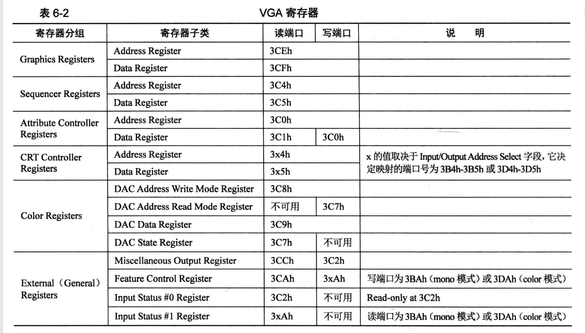
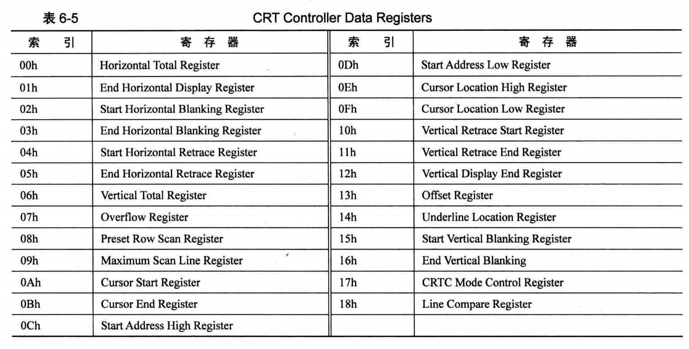

# 实现自己的打印函数

要实现自己的打印函数，需要了解显卡的端口控制知识.编写完代码后，还需要修改Makefile让整个编译流程串起来。运行成功，会在屏幕中出现kernel的字符串


# 通过端口控制显卡行为

和通过端口访问硬盘的方式一样，显卡也是通过address register与data register的方式来访问显卡中的其他端口，从而控制显卡的行为。
address register与data register的端口号是根据另一个寄存器Miscellaneous Output Register的`I/OAS`位决定的，该位值默认为1

address register、data register端口号
当`I/OAS`值为0时，端口号为 0x3b4h,0x3b5h
当`I/OAS`该值为1时，端口号为 0x3d4h,0x3d5h


## 以获取光标的位置为例如下 ：
```asm
;;;;;;;;;  获取当前光标位置 ;;;;;;;;;
   ;先获得高8位
   mov dx, 0x03d4  ;索引寄存器
   mov al, 0x0e	   ;用于提供光标位置的高8位
   out dx, al
   mov dx, 0x03d5  ;通过读写数据端口0x3d5来获得或设置光标位置 
   in al, dx	   ;得到了光标位置的高8位
   mov ah, al

   ;再获取低8位
   mov dx, 0x03d4
   mov al, 0x0f
   out dx, al
   mov dx, 0x03d5 
   in al, dx
```
返回的光标值是偏移显存首地址的字符数，ax * 2则可以得到地址的偏移量 。al用来传递功能号



## 滚屏
文本模式80*25，最多能显示2000个字符，4000个字节。显存有32K，最多能放32K/4000B=8,可以存放8屏的内容。这8屏的字符肯定不能一下子都显示在1个屏幕
上，所以显卡就为咱们提供了`0Ch`、`0Dh`两个寄存器，用来设置显存中那些哪个字符作为屏幕的首字符。

通过调整这两个寄存器的值就可以实现滚屏的效果了，但代码写起来会复杂些，随书代码print.S中通过
将第二行的字符全部往前挪的方式，把第一行字符覆盖了，从而实现了滚屏的效果。


# 修改Makefile

```makefile

$(BUILD)/lib/kernel/print.o:
	nasm -f elf32 lib/kernel/print.asm -o ${BUILD}/lib/kernel/print.o

$(BUILD)/kernel/kernel.bin: kernel/main.c
	# 生成32位的目标文件
	gcc -m32 -c -I lib/kernel -o $(BUILD)/kernel/main.o kernel/main.c
	# 使用链接器生成可执行文件
	ld -m elf_i386 -Ttext 0xc0001000 -e main -o $(BUILD)/kernel/kernel.bin $(BUILD)/kernel/main.o $(BUILD)/lib/kernel/print.o
```

1、print.asm编译的时候，需要指定elf32格式，因为main.c中调用了print.asm的put_char函数。链接main.o生成可执行文件kernel.bin的时候需要链接print.o
2、编译main.c的时候，引用了print.h头文件需要通过`-I lib/kernel`选项指定`print.h`所在目录