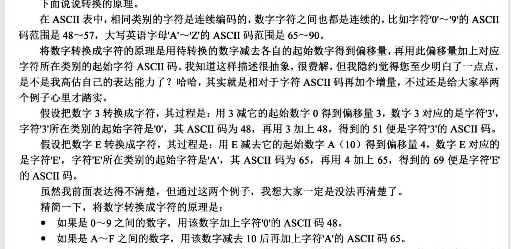

# 打印字符串与整数

该小节是基于上一小节的put_char实现字符串、整数的打印。属于练习汇编以及熟悉系统服务实现的小节，建议自己边思考如何实现边对随书代码完成。


# 部分代码的解析

## call指令
call指令会将下一条指令的地址写入栈中，然后跳转到函数中执行。如下：

```asm
global put_int
put_int:
   pushad
   mov ebp, esp
   mov eax, [ebp+4*9]		       ; call的返回地址占4字节+pushad的8个4字节
   mov edx, eax
   mov edi, 7                          ; 指定在put_int_buffer中初始的偏移量
   mov ecx, 8			       ; 32位数字中,16进制数字的位数是8个
   mov ebx, put_int_buffer
```
C语言默认采用的cdecl调用约定，通过栈传递参数，函数中需要通过对ebp进行计算获取入参。
代码中的`[ebp+4*9]` 是的逻辑是   C代码中调用put_int函数是通过call指令调的，所以会往esp写入4个字节的返回地址，然后pushad指令也会压入8个32位寄存器的值
所以总共9*4个字节。ebp加法操作原因是 X86中栈是向下扩展的，压入数据是 对esp进行减法操作。


## 整形转16进制

x86栈是向下扩展的，所以push一个4字节的值后，esp的值就是该值的低位。
直接取esp的值，然后每4位转换成一个字，然后调用put_char打印。

如何每4位转换成一个字符呢？


获取低8位，并赋值给到了edx，然后对edx进行与操作，只保留低4位。
然后拿低4位判断，如果大于9则该字符是A~F跳转到 .is_A2F中处理
.is_A2F的逻辑就是就是计算偏移量，然后加字符对应的起始值得到 字符对应的ascii码
循环上面的逻辑即可得到整形对应的16进制表示

```asm
global put_int
put_int:
    pushad
    mov ebp, esp
    mov eax, [ebp+4*9]		       ; 此时eax拿到的是 整数的第一个字节， 低8位
    mov edx, eax                     
    ...                             ;省略了部分代码
    and edx, 0x0000000F		       ; 解析16进制数字的每一位。and与操作后,edx只有低4位有效
    jg .is_A2F
    add edx, '0'			       ; ascii码是8位大小。add求和操作后,edx低8位有效。
    jmp .store
.is_A2F:
    sub edx, 10			       ; A~F 减去10 所得到的差,再加上字符A的ascii码,便是A~F对应的ascii码
    add edx, 'A'
```



## put_int_buffer的作用

随书代码中在print.S一开始的地方用dq命令占用了8个字节，用于后续缓存每一个ascii码
因为一个32位整形转换成16进制共8个字符。

由于代码是从低位进行转换的，而屏幕显示是从高位显示的，所以用了put_int_buffer来把所有的
字符都转换完成后才去打印。
```asm
.store:
    ; 此时dl中应该是数字对应的字符的ascii码
    mov [ebx+edi], dl
    dec edi
    shr eax, 4
    mov edx, eax
    loop .16based_4bits
```

ebx就是put_int_buffer的起始地址，edi =7 ,表示先写高位。书中说这是模拟了"大端"字节序的方式存储数据，其实是为了方便后续打印的时候，先显示高位，然后再显示低位字符。
.put_each_num就是打印的逻辑，此时edi值=0，第一个打印的是高位的字符。
```asm
.put_each_num:
   push ecx			       ; 此时cl中为可打印的字符
   call put_char
   add esp, 4
   inc edi			       ; 使edi指向下一个字符
   mov cl, [put_int_buffer+edi]	       ; 获取下一个字符到cl寄存器
   cmp edi,8
   jl .put_each_num
   popad
   ret
```


