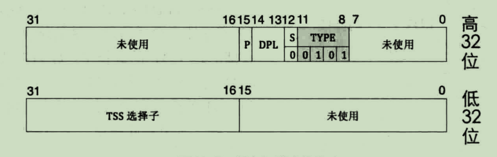
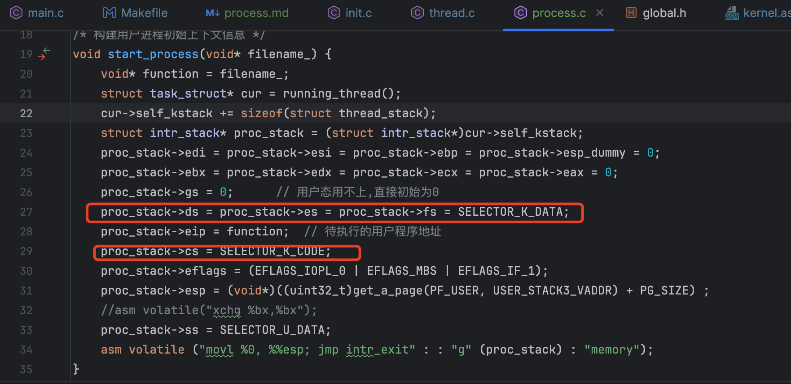

# 进程
本章的用户进程是在第9章的线程的基础上实现的。 看书的时候，关于本章的一些疑问点如下：
1. bss段的章节是干嘛的？
2. 创建用户进程的页表目录 
3. 用户进程的虚拟内存池起始地址为什么是0x8048000？
4. tss起到了什么作用？
5. 进程是如何启动和切换的？

## bss段
bss段中的数据是未初始化的全局变量和局部静态变量。只有在程序加载到内存的时候，才会执行初始化操作，分配内存。
以下是通过`readelf -S`输出的linux下find程序section关于bss段的信息
```shell
  [27] .bss              NOBITS           0000000000045480  00044478
       0000000000000a60  0000000000000000  WA       0     0     32
```
`NOBITS`说明该段在 ELF 文件中没有实际的数据。

书中该章节的说明主要是为了说明两个点：
1. bss段会被链接器合并到data段中
2. 栈的起始地址在bss段后面

堆内存的分配，在以后得malloc方法中实现。


## 用户进程的页目录

### 页目录的起始地址
创建页目录第一件事就是找个地方来放页目录的数据，正如我们前面实现的loader.asm中
0x100000. 作者是通过从内核内存池中获取一个页，将该页用于存储用户进程的页目录。
二级分页，页目录刚好是4KB大小。
```c
/* 创建页目录表,将当前页表的表示内核空间的pde复制,
 * 成功则返回页目录的虚拟地址,否则返回-1 */
uint32_t* create_page_dir(void) {

    /* 用户进程的页表不能让用户直接访问到,所以在内核空间来申请 */
    uint32_t* page_dir_vaddr = get_kernel_pages(1);
    if (page_dir_vaddr == NULL) {
        console_put_str("create_page_dir: get_kernel_page failed!");
        return NULL;
    }
    ...省略
}
```
但有个问题`get_kernel_pages`返回的是虚拟地址，但是CPU用来寻找页目录的寄存器CR3中存储的
是物理地址，因此，我们需要将`get_kernel_pages`中得到的虚拟地址转换成物理地址。


### 虚拟地址转物理地址
二级分页的虚拟地址转物理地址的算法，在书的5.2章中有详细说明。假设我们现在通过
`get_kernel_pages`得到了一个虚拟地址,使用该地址作为用户进程的
页目录存储地址。但是该地址是虚拟地址，但我们CR3寄存器中存储的得是物理地址，因此我们还要对地址进行转换。

因为该地址是在内存池中申请的，申请的时候，自然会在当前页目录中添加映射关系。
所以只要我们按照二级分页的转换算法，计算一遍就可以得到对应的物理地址了。

这里面有个隐含的逻辑，启动进程是通过调用`process.c`中的process_execute函数启动的
此时申请得到的内存必定在当前的页目录中建立了映射，此时只要在切换到其他线程前
通过转换算法计算即可得到物理地址。 转换代码如下：
```c
/* 得到虚拟地址映射到的物理地址 */
uint32_t addr_v2p(uint32_t vaddr) {
    uint32_t* pte = pte_ptr(vaddr);
/* (*pte)的值是页表所在的物理页框地址,
 * 去掉其低12位的页表项属性+虚拟地址vaddr的低12位 */
    return ((*pte & 0xfffff000) + (vaddr & 0x00000fff));
}
```

这里物理地址由两部分组成
```c
((*pte & 0xfffff000) + (vaddr & 0x00000fff))
```
这里面后半部分，是取虚拟地址的最后12位偏移量，因为虚拟地址和物理地址的偏移量都是一样的
所以直接取并想加即可。重点是前半部分理解起来有点绕。

```c
/* 得到虚拟地址vaddr对应的pte指针*/
uint32_t* pte_ptr(uint32_t vaddr) {
    /* 先访问到页表自己 + \
     * 再用页目录项pde(页目录内页表的索引)做为pte的索引访问到页表 + \
     * 再用pte的索引做为页内偏移*/
    uint32_t* pte = (uint32_t*)(0xffc00000 + \
	 ((vaddr & 0xffc00000) >> 10) + \
	 PTE_IDX(vaddr) * 4);
    return pte;
}
```

pte_ptr中，待计算的虚拟地址的三个部分会被转换成：  
pde的10个二进制位 会被替换成1023的二进制位  
pte的10个二进制为 会被原来的虚拟地址原来的pde值替换  
偏移量会替换为  pte在页表中的偏移量  

整个计算结果得到的结果就是 一个指向无符号的32位整数的指针，该指针的值是一个虚拟地址。
当对该指针进行解指针操作的时候，就会通过虚拟地址找到对应的物理地址，并物理地址对应的值。

取值的过程如下：  
第一步取pde，发现是1023，所以会去当前的页目录中找1023个项的值，因为该方法是从main.c中执行process_execute
走到这的，所以页目录是内核的页目录，其1023项的值就是内核页目录的起始地址0x100000.

第二步是取pte,此时的pte已经被替换成原虚拟地址的pde，所以又会从内核的页目录的起始地址重新找到
原虚拟地址的正确的页目录的值。该值是在`get_kernel_pages`申请内存的时候添加的，所以没有什么问题

第三步是根据偏移量组成最终的物理地址，此时偏移量已经是替换后的原pte在页表中的偏移量，因此虚拟地址转换物理地址得到的结果就是
原虚拟地址在内核页目录中页表项的位置。 因为我们申请的内存是按页分配的，偏移量就是000，所以至此，虚拟地址的物理地址已经找到了，转换
的流程结束。


### 页目录初始化
用户进程是通过调用内核的例程来完成任务的，所以用户进程需要知道内核的例程在内存的哪个位置，在调用的时候才能跳转过去。
所以，我们还要对用户进程的页目录进行初始化. 初始化的内容就是：
1. 复制内核的页目录项到用户进程的页目录中
第768项对应的页表映射的范围是 0xc0000000~0xc03fffff ，共4mb，这个是我在内存管理章节分配的内核地址[内存管理](memroy_manager.md)有说明。
2. 将页目录最后一项更新为用户进程页目录的起始地址


随书代码复制页目录代码如下：
```c
uint32_t* create_page_dir(void) {
    .... 省略
/************************** 1  先复制页表  *************************************/
    /*  page_dir_vaddr + 0x300*4 是内核页目录的第768项 */
    memcpy((uint32_t*)((uint32_t)page_dir_vaddr + 0x300*4), (uint32_t*)(0xfffff000+0x300*4), 1024);
/*****************************************************************************/

/************************** 2  更新页目录地址 **********************************/
    uint32_t new_page_dir_phy_addr = addr_v2p((uint32_t)page_dir_vaddr);
    /* 页目录地址是存入在页目录的最后一项,更新页目录地址为新页目录的物理地址 */
    page_dir_vaddr[1023] = new_page_dir_phy_addr | PG_US_U | PG_RW_W | PG_P_1;
/*****************************************************************************/

    return page_dir_vaddr;
}
```
上述的代码意思是，将内核页目录的768项到1023项都复制到用户进程的页目录中，然后将用户进程页目录起始地址更新到页目录的1023项处。


## 用户进程的起始地址为啥是0x8048000

0x8048000转换成mb是128mb,也就是用户的虚拟地址空间起始地址是128mb附近，符合我们之前安排的
低3G的内存地址用于用户空间。至于为什么是0x8048000，就和0x7c00是boot程序入口一样，属于旧俗约定。
现在的程序好像已经逐渐不用改地址了。


## TSS
tss是CPU提供的切换任务的方式，所谓的任务就是我们说的线程切换。在第9章中，我们实现的线程是基于时钟中断触发中断例程（中断门）的方式来实现的。
这种方式，CPU不认为是任务切换，因此不会更新TSS。在实现线程的时候，没有发生特权级的变化，所以用不上tss，但是本章节中实现的是用户进程，起特权级是
3。

### 任务门描述符
第7.4章介绍中断描述符表的时候，有说过中断描述符表中除了中段描述符外，还有任务门描述符、陷阱门描述符。但是该章节中的任务门是定义在GDT中的。
中断描述符表（IDT）可以存储任务门的描述符，并在特定的中断或异常处理场景下使用它来触发任务切换。
任务门在 IDT 中主要用于切换到处理特定中断或异常的任务，特别是在处理需要特权级别转换或严重错误（如双重故障）时。

描述符的类型是根据S位和TYPE类型决定的。
任务门描述符结构如下：



因为需要在GDT中添加描述符，我的GDT描述符的起始地址与作者的不同，因此要修改tss.c中关于GDT描述符的起始地址
```c

    /* gdt段基址为0x900,把tss放到第4个位置,也就是0x900+0x20的位置 */
    /* 在gdt中添加dpl为0的TSS描述符 */
    *((struct gdt_desc*)0x523) = make_gdt_desc((uint32_t*)&tss, tss_size - 1, TSS_ATTR_LOW, TSS_ATTR_HIGH);

    /* 在gdt中添加dpl为3的数据段和代码段描述符 */
    *((struct gdt_desc*)0x52b) = make_gdt_desc((uint32_t*)0, 0xfffff, GDT_CODE_ATTR_LOW_DPL3, GDT_ATTR_HIGH);
    *((struct gdt_desc*)0x534) = make_gdt_desc((uint32_t*)0, 0xfffff, GDT_DATA_ATTR_LOW_DPL3, GDT_ATTR_HIGH);

    /* gdt 16位的limit 32位的段基址 */
    uint64_t gdt_operand = ((8 * 7 - 1) | ((uint64_t)(uint32_t)0xc0000503 << 16));   // 7个描述符大小
```
0x20 = 32 ，刚好是4个描述符的大小，所以作者代码中起始地址是0x900,所以真实物理地址是0x920。但在启动分页功能时，作者将虚拟地址低端的1mb以及3G以上1mb都映射到
物理内存的1mb处。因此这里GDT地址0xc000920与0x920是指向一样的地方的。

我的loader.asm中，开头还有一行jmp指令，占了3个字节，并且我是让低端的1mb映射到它自己本身，所以GDT的起始地址0x503。

<font color="red">此处计算gdt地址有错误，具体看后面的 运行过程中异常定位 说明</font>

### TSS在啥时候发挥作用

当从低特权级切换到高特权级时（例如，从用户模式切换到内核模式），CPU会自动切换到对应的栈。这是通过任务状态段（TSS）中的特权级栈指针来实现的。
TSS包含了每个特权级（0、1、2、3）对应的栈指针。当发生特权级切换时（例如，由中断或系统调用引发），CPU会从TSS中取出相应特权级的栈指针，并切换到该栈。

在tss中只有0、1、2级的ss、esp属性，这是因为当特权级为3切换到高特权级的时候，往往是通过中断、任务门等方式触发的。
中断以及任务门触发时，CPU都会从TSS中获取特权级的栈地址更新到寄存器中，特权级会从3->0, CPU会从tss获取esp0的值作为esp寄存器的值。

## 用户进程是如何启动和切换的

用户进程切换和启动时通过时钟中断触发的

1. 首先通过process_execute方法构建和初始化了用户进程的pcb，并与内核线程一样
将pcb加入了等待运行的队列中
2. 当时钟中断来了，会从等待运行的队列中拿到用户进程的pcb，然后switch_to会切换到用户进程pcb中的eip
3. 用户进程的pcb的eip会指向start_process, 在start_process中会构建itred中断返回时使用的栈的内容
4. start_process最后会调用内联汇编跳转到kernel.s的中断返回函数通过itred指令返回到用户进程真正要 
执行的函数u_prog_b中


## 运行过程中异常定位


### bochs宕机重启问题
代码写好后，运行会莫名奇妙的直接重启了bochs（指，又回到了bochs启动时的样子）。

这种情况可能是触发了page fault， 通过sba指令，在触发异常前打上断点，下一条指令leave就会触发宕机。leave指令的作用就是从当前esp出栈ebp，并重置ebp。
经查看ebp的值为0x00000000,因此导致宕机。为什么是0x00000000,仔细查看，leave指令执行的时候，正处于时钟中断返回，第一次切换到用户进程运行。
ebp值不对，说明是用户进程的栈初始化出了问题。

查看代码初始化的值是正确的，然后查看gdt表，发现gdt表中没有对应的页目录项。由于中断返回的时候，已经执行了页目录切换，用户进程的页目录中没有
0x0~0xfffff的映射项（低端的1mb）的映射。


### GP异常问题
从上一个问题发现，是用户进程能够切换后触发了宕机异常，解决宕机异常后，变成了触发GP异常。
GP异常是访问了不该访问的内存地址导致的.


怀疑是用户进程无法访问test_a以及test_b变量,也就是特权级校验不通过。于是修改start_process方法代码如下：

再次运行，没有再触发GP异常了，所以问题可能是用户进程的特权级校验有问题导致。
难道是在访问main方法里面的test_a等变量时，存在特权级校验问题？


恢复代码后，通过show int指令，得到GP异常时的断点位置，然后用sba将断点打到异常中断的地址，
由于中断发生的时候，CPU会自动将一些寄存器入栈。有两种情况一种是发生了特权级转换，另一种是没有特权级转换。
无论是哪种，栈顶存储的都是error_code、eip_old、cs_old。 查看栈的情况如下
```shell
<bochs:4> print-stack
print-stack
Stack address size 4
 | STACK 0xc0401ee8 [0x00000000] (<unknown>)
 | STACK 0xc0401eec [0xc0001876] (<unknown>)
 | STACK 0xc0401ef0 [0x00000008] (<unknown>)
 | STACK 0xc0401ef4 [0x00010286] (<unknown>)
```

段选子是0x8,说明我这里的情况是切换到用户进程的过程中出问题了，还没有切换成功，段选择子仍旧是第3个段选择子.
用户进程的段选择子应该是0x28!

本章的用户进程切换是通过构建内核栈 + itred指令的方式返回的，所以怀疑是栈或者tss有问题。
因为前面改了段选择子就可以正常运行了，怀疑是特权级校验不通过

特权级校验是在访问虚拟地址的时候，会拿段选择子的特权级作为CPL与页目录项中DPL
进行比较，由于在loader.S中，页目录项的DPL为1，允许任何特权级访问，因此页目录的特权级是没问题的
那么段选子的DPL呢？

经检查用户进程的段选择子的DPL也是正常的。那么是GDT表中的DPL不对？
通过info gdt查看，发现gdt表如下：
```shell
<bochs:5> info gdt
info gdt
gdt (base=0x0000000000000503, limit=55):
gdt[0x0000]=<null entry>
gdt[0x0008]=Code segment, base=0x00000000, limit=0xffffffff, Execute-Only, Non-Conforming, Accessed, 32-bit
gdt[0x0010]=Data segment, base=0x00000000, limit=0xffffffff, Read/Write, Accessed
gdt[0x0018]=Data segment, base=0x000b8000, limit=0x00007fff, Read/Write, Accessed
gdt[0x0020]=32-Bit TSS (Busy) at 0xc0008620, length 0x0006b
gdt[0x0028]=Code segment, base=0x00000000, limit=0xffffffff, Execute-Only, Non-Conforming, 32-bit
gdt[0x0030]=??? descriptor hi=0xcff20000, lo=0x00ffff00
You can list individual entries with 'info gdt [NUM]' or groups with 'info gdt [NUM] [NUM]'
<bochs:6> 
```
发现第7个gdt项是???，说明第7个有问题，硬件识别不了。
第7项刚好是用户进程使用的数据段的gdt项。 然后去检查gdt表生成的代码，发现是第7项
的地址计算错了！！！！

tss.c中init_tss代码
```c
 /* 在gdt中添加dpl为3的数据段和代码段描述符 */
    *((struct gdt_desc*)0x52b) = make_gdt_desc((uint32_t*)0, 0xfffff, GDT_CODE_ATTR_LOW_DPL3, GDT_ATTR_HIGH);
    *((struct gdt_desc*)0x534) = make_gdt_desc((uint32_t*)0, 0xfffff, GDT_DATA_ATTR_LOW_DPL3, GDT_ATTR_HIGH);

```
应该把0x534改成0x533即可！！！！


