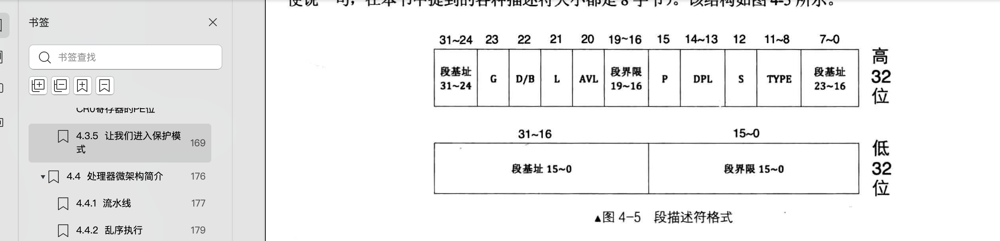

## 保护模式


### mbr修改加载扇区数

读取硬盘的扇区改为4了，由于之前在boot.inc下定义的loader是加载到0x500的位置，0x500位置还有多少空间可以用呢？


### GDT描述符


#### 二进制表示方式
nasm编译器为了方便阅读，支持如boot.inc的 `1_0000....`这种写法
```asm
DESC_G_4K   equ	  1_00000000000000000000000b
DESC_D_32   equ	   1_0000000000000000000000b
```
nasm编译器会在编译阶段就忽略掉`_`符号。所以
`1000_1000b`对应的就是`0x88`.

#### boot.inc中变量说明
boot.inc中分别定义各个字段，然后将各个字段拼接在一起就能凑成一个GDT描述符了
```asm
DESC_CODE_HIGH4 equ (0x00 << 24) + DESC_G_4K + DESC_D_32 + DESC_L + DESC_AVL + DESC_LIMIT_CODE2 + DESC_P + DESC_DPL_0 + DESC_S_CODE + DESC_TYPE_CODE + 0x00

```
简单的示例说明如下：  
a = b + c  
b= 0001b  
c= 1000b  
所以 a = 1001b  
之所以能成立，是因为DESC_X_XX 等变量中的1是独占属于它的那一位的


#### GDT描述符结构
为了方便记忆


如图所示, GDT描述的低32位是段基址 + 段界限值。由于采用的是平坦模式，所以段基址都是0，段界限值最大都是f
因此低32位  =  0x0000ffff

高32位则在boot.inc中定义了，如
```asm
DESC_CODE_HIGH4 equ (0x00 << 24) + DESC_G_4K + DESC_D_32 + DESC_L + DESC_AVL + DESC_LIMIT_CODE2 + DESC_P + DESC_DPL_0 + DESC_S_CODE + DESC_TYPE_CODE + 0x00

```
DESC_CODE_HIGH4 是 高24位 ( 0x00 << 24 + 各个变量想加之和) + 低8位 （0x00）

所以在loader程序中定义描述就可以像下面这样即可
```asm
    ;构建gdt及其内部的描述符
    ;GDT表的第一个描述符必须是空描述符(全是0)，CPU硬性规定
    GDT_BASE:
        dd 0x00000000
        dd 0x00000000
    CODE_DESC:
        dd 0x0000FFFF
        dd DESC_CODE_HIGH4
```


#### GDTR寄存器
32位GDT内存起始地址 + 16位段界限

#### 选择子格式
13位索引值 + 1位TI + 2位RPL

TI=0表示是GDT描述符，TI=1表示LDT描述符


#### 最后显示P字符表示进入保护模式成功了
```asm
mov byte [gs:160], 'P'
```
loader最后的代码中 gs是段选择子，160是偏移量
视频段的GDT描述符为
```asm
    VIDEO_DESC:
        dd 0x80000007;limit=(0xbffff-0xb8000)/4k=0x7
	    dd DESC_VIDEO_HIGH4  ; 此时dpl已改为0
```
因此是将字符P写到0x8000:160的内存地址中。
文本模式默认为80*25模式，即80列*25行，每个字为2个字节
第一行占用了0~179个字节，160是第二行第一个字节，低字节用于存储ascii码,因此显示效果为P字，第二个字节默认值是白字黑底


