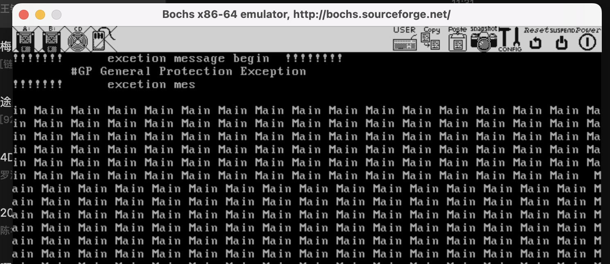
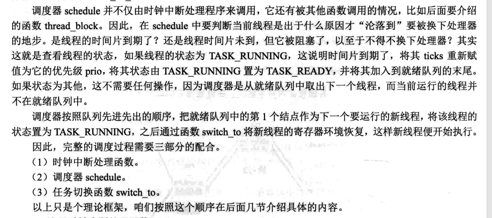

# 线程


代码完成后，可以顺利触发GP异常则表示线程可以顺利切换了，本章的代码算是完成了



在看线程的章节的时候，我有以下几个疑问
1. pcb的作用是什么,pcb里面有些什么东西?
2. 线程的调度的逻辑是怎样的?
3. switch_to函数调用的时候为什么要入栈那几个寄存器
4. main函数怎么调度?


## PCB
进程的身份证PCB， 通过PCB可以解决以下问题
1. 要加载1个任务上处理器运行，任务由哪来？也就是说，调度器从哪里才能找到该任务？
2. 即使找到了任务，任务要在系统中运行，其所需要的资源从哪里获得？
3. 即使任务已经变成进程运行了，此进程应该运行多久呢？总不能让其独占处理器吧。
4. 即使知道何时将其换下处理器，那当前进程所使用的这 套资源（寄存器内容）应该存在哪里？ 
5. 进程被换下的原因是什么？下次调度器还能把它换上处理器运行吗？ 
6. 进程独享地址空间，它的地址空间在哪里？


要知道PCB是怎么解决的，需要先了解pcb的结构是怎样的


pcb并没有固定的格式，它的结构取决于操作系统的复杂度。当操作系统需要的时候，可以往pcb里面塞进程相关的信息。每个进程都有自己的pcb，pcb是一块内存，
里面记录了进程相关的信息，比如进程状态、 PID 、优先级等。 那么随书代码中定义的PCB有些什么内容呢？

```c

/* 进程或线程的pcb,程序控制块 */
struct task_struct {
   uint32_t* self_kstack;	 // 各内核线程都用自己的内核栈
   enum task_status status;
   char name[16];
   uint8_t priority;
   uint8_t ticks;	   // 每次在处理器上执行的时间嘀嗒数

/* 此任务自上cpu运行后至今占用了多少cpu嘀嗒数,
 * 也就是此任务执行了多久*/
   uint32_t elapsed_ticks;

/* general_tag的作用是用于线程在一般的队列中的结点 */
   struct list_elem general_tag;				    

/* all_list_tag的作用是用于线程队列thread_all_list中的结点 */
   struct list_elem all_list_tag;

   uint32_t* pgdir;              // 进程自己页表的虚拟地址
   uint32_t stack_magic;	 // 用这串数字做栈的边界标记,用于检测栈的溢出
};
```

这里不好理解的是`self_kstack`,通过看`init_thread`与`thread_create`方法就清晰了，
```c
/* 初始化线程栈thread_stack,将待执行的函数和参数放到thread_stack中相应的位置 */
void thread_create(struct task_struct* pthread, thread_func function, void* func_arg) {
   /* 先预留中断使用栈的空间,可见thread.h中定义的结构 */
   pthread->self_kstack -= sizeof(struct intr_stack);

   /* 再留出线程栈空间,可见thread.h中定义 */
   pthread->self_kstack -= sizeof(struct thread_stack);
   struct thread_stack* kthread_stack = (struct thread_stack*)pthread->self_kstack;
   ....省略
}
```
self_kstack指向了，4kb中的高位地址，然后在创建线程时，顶端存放中断时候入栈的寄存器接着是线程的上下文所用的寄存器。


## 线程调度

在线程初始化的时候，会把main方法封装成线程，也就是构建对应的PCB然后加入到调度的对列中。随着时钟中断不断被调用以及切换。


也就是在定时器初始化的时候，为中断号为0x20注册一个中断处理函数。
该中断函数的就是


## switch_to逻辑
都只要要切换到其他线程去，但是到底是如何切换的呢？答案就在switch_to函数中

```asm
switch_to:
   ;栈中此处是返回地址	       
   push esi
   push edi
   push ebx
   push ebp

   mov eax, [esp + 20]		 ; 得到栈中的参数cur, cur = [esp+20]
   mov [eax], esp                ; 保存栈顶指针esp. task_struct的self_kstack字段,
				 ; self_kstack在task_struct中的偏移为0,
				 ; 所以直接往thread开头处存4字节便可。
;------------------  以上是备份当前线程的环境，下面是恢复下一个线程的环境  ----------------
   mov eax, [esp + 24]		 ; 得到栈中的参数next, next = [esp+24]
   mov esp, [eax]		 ; pcb的第一个成员是self_kstack成员,用来记录0级栈顶指针,
				 ; 用来上cpu时恢复0级栈,0级栈中保存了进程或线程所有信息,包括3级栈指针
   pop ebp
   pop ebx
   pop edi
   pop esi
   ret				 ; 返回到上面switch_to下面的那句注释的返回地址,
				 ; 未由中断进入,第一次执行时会返回到kernel_thread
```
这个是用来切换的的汇编函数，一眼看过去会以为 上面4个push与下面的4个pop是一组的，
但其实并不是，上面的4个寄存器是当前线程的4个寄存器，后面的4个pop的是要切换的线程的4个寄存器。
为什么是这4个寄存器？ 因为根据ABI ，除esp外，只保护 esi、edi 、ebx ebp即可。

```asm
   mov eax, [esp + 20]		 ; 得到栈中的参数cur, cur = [esp+20]
   mov [eax], esp                ; 保存栈顶指针esp. task_struct的self_kstack字段,
				 ; self_kstack在task_struct中的偏移为0,
				 ; 所以直接往thread开头处存4字节便可。
;------------------  以上是备份当前线程的环境，下面是恢复下一个线程的环境  ----------------
   mov eax, [esp + 24]		 ; 得到栈中的参数next, next = [esp+24]
   mov esp, [eax]	
```
之所以会出现上下4个寄存器变了，是因为中间这4句汇编代码把esp改了
第一句的[esp + 20]是函数入参当前线程的pcb。
```c
struct task_struct {
   uint32_t* self_kstack;	 // 各内核线程都用自己的内核栈
   enum task_status status;
   uint8_t priority;		 // 线程优先级
   char name[16];
   uint32_t stack_magic;	 // 用这串数字做栈的边界标记,用于检测栈的溢出
};
```
[esp+20]就是task_struct的self_kstack指针，该指针在初始化的时候
指向了`thread_stack`。`thread_stack`的第一个成员变量就是ebp（虽然变量名叫ebp但其实是esp）。 于是，第二句把当前线程的esp存储到了PCB中thread_stack中了。
后两句则是把esp指向了新线程的esp。esp赋值好了之后，就是4连pop，把上次切换时存储的4几个寄存器还原，其中就包括了ebp.最后的ret指令会结束
`switch_to`函数返回到scheduler函数，scheduler结束返回到时钟中断处理函数`intr_timer_handler`,最终回到`kernel.S`中的`intr0x20entry`

## main函数封装成线程

在理解了线程是如何调度之后，就有一个问题：其他线程都是通过thread_start函数启动的，main函数已经跑了一半了怎么办？
main函数没有pcb，中断之后就回不来了！因此我们要将main函数封装成线程，也就是给它搞个pcb。
在执行init_all函数中，调用了thread.c中的thread_init函数。
```c
/* 初始化线程环境 */
void thread_init(void) {
    put_str("thread_init start\n");
    list_init(&thread_ready_list);
    list_init(&thread_all_list);
    /* 将当前main函数创建为线程 */
    make_main_thread();
    put_str("thread_init done\n");
}
```
其中make_main_thread函数就是用来将main函数封装成线程的。
之前在内存管理章节中提到了pcb的起始地址必须是 OxXXXXX000，然后作者在设置栈的地址时，分配的是0xc009f000（ loader.S开启分页后赋值的）。
因为在这里，需要通过esp的地址来获取pcb的地址。
```c
/* 获取当前线程pcb指针 */
struct task_struct* running_thread() {
    uint32_t esp;
    asm ("mov %%esp, %0" : "=g" (esp));
    /* 取esp整数部分即pcb起始地址 */
    return (struct task_struct*)(esp & 0xfffff000);
}
```
由于我在前面章节实现的时候，内存的布局是和作者不同的，这里我要在`loader.asm`中补上esp寄存器的赋值
```c
enter_kernel:
    mov esp,0xc03fb000 ; 后续实现线程需要用到
    call kernel_init
    jmp SELECTOR_CODE:KERNEL_START_ADDR
```
这里选0xc3fb000原因是上一章节内存管理实现时，0xc03fb000被用了，0xc03fa000是空的。但因为栈是向下扩展的，所以esp地址仍旧是0xc03fb000
内存使用情况[内存分配](memroy_manager.md)


## debug程序笔记
代码抄完后，运行起来，发现和书上说的不一样，bochs控制台打印了多个main之后，就一直打印的argA，看起来就像是在线程A回不去了。对比代码后发现是在
```c
/* 由kernel_thread去执行function(func_arg) */
static void kernel_thread(thread_func* function, void* func_arg) {
/* 执行function前要开中断,避免后面的时钟中断被屏蔽,而无法调度其它线程 */
    //asm volatile("xchg %bx,%bx");
    intr_enable();   //如果没有开启,则无法触发中断调度
    //asm volatile("xchg %bx,%bx");
    function(func_arg);
}
```

执行线程方法的时候，缺了`intr_enable()`开启中断这个操作，加上之后就能够触发GP异常了。
令我不解的是   
在main方法的时候，通过开启了中断，才会触发了调度函数然后切换到别的线程。中断发生的时候，会保存eflags寄存器，在中断返回的时候会恢复eflags寄存器。
但是中断返回后，查看eflags的if位 = 0 表示屏蔽中断，因此一直在打印argA

那么我们去看看中断发生时，压入栈中的eflags的值是什么。 书的7.6.3小节有详细的步骤说明。
在[中断](interrupt.md) 中可以回顾一下eflags在栈的哪个位置。

大体步骤如下：


在`kernel_thread`处用内敛汇编打上断点，
然后启动bochs后，执行命令`show extint`输出硬件中断信息, 输入`c`继续执行
然后会输出像下面的一大串信息
```shell
00016919223: exception (not softint) f000:fea6 (0x000ffea6)
00017138916: exception (not softint) f000:fea6 (0x000ffea6)
00017608467: exception (not softint) 0008:c0001b59 (0xc0001b59)
00017608737: exception (not softint) 0008:c0001b59 (0xc0001b59)
00017609257: exception (not softint) 0008:c0001b59 (0xc0001b59)
```

看地址f000:fea6看起来就不对，因为我们要看的中断信息是在进入了保护模式之后且开启了分页功能的。

重启bochs,然后用取上面输出的指令数减一，例如取上面最后一行的示例00017609257，输入指令 `sba 00017609256`
继续运行，然后看eflags的值
```shell
<bochs:1> sba 00017609256
sba 00017609256
Time breakpoint inserted. Delta = 17609256
<bochs:2> c
c
(0) Caught time breakpoint
Next at t=17609256
(0) [0x000000301bf0] 0008:00000000c0001bf0 (unk. ctxt): mov byte ptr gs:[bx], cl  ; 6567880f
<bochs:3> r
r
rax: 00000000_c000078b
rbx: 00000000_c0000f16
rcx: 00000000_00000061
rdx: 00000000_c04003d5
rsp: 00000000_c03fafac
rbp: 00000000_c03faff8
... 省略
rip: 00000000_c0001bf0
eflags: 0x00000202: id vip vif ac vm rf nt IOPL=0 of df IF tf sf zf af pf cf
```
如上，可以看到eflags处IF是大写的，表示当前值=1，是开中断的状态。继续看下一条的执行命令是什么
```shell
<bochs:5> u /5
u /5
00000000c0001bf0: (                    ): mov byte ptr gs:[bx], cl  ; 6567880f
00000000c0001bf4: (                    ): inc bx                    ; 6643
00000000c0001bf6: (                    ): mov byte ptr gs:[bx], 0x07 ; 6567c60707
00000000c0001bfb: (                    ): shr bx, 0x01              ; 66d1eb
00000000c0001bfe: (                    ): inc bx                    ; 6643
```
可以看到下一条指令时继续写字符，但是我们执行`s`指令到下一条命令的时候却变成了`push ds`,再看接下来的指令都变了，说明中断发生了。
```shell
<bochs:5> u /5
u /5
00000000c0001bf0: (                    ): mov byte ptr gs:[bx], cl  ; 6567880f
00000000c0001bf4: (                    ): inc bx                    ; 6643
00000000c0001bf6: (                    ): mov byte ptr gs:[bx], 0x07 ; 6567c60707
00000000c0001bfb: (                    ): shr bx, 0x01              ; 66d1eb
00000000c0001bfe: (                    ): inc bx                    ; 6643
<bochs:6> s
s
Next at t=17609257
(0) [0x000000301b59] 0008:00000000c0001b59 (unk. ctxt): push ds                   ; 1e
<bochs:7> u /5
u /5
00000000c0001b59: (                    ): push ds                   ; 1e
00000000c0001b5a: (                    ): push es                   ; 06
00000000c0001b5b: (                    ): push fs                   ; 0fa0
00000000c0001b5d: (                    ): push gs                   ; 0fa8
00000000c0001b5f: (                    ): pusha                     ; 60
```
此时已经跳转到了kernel.S的中断模板函数了，eflags也已经压入栈里面了。
接下来用bochs的调试命令查看栈中的信息
```shell
<bochs:8> print-stack 10
print-stack 10
Stack address size 4
 | STACK 0xc03faf9c [0x00000000] (<unknown>)   # 错误码
 | STACK 0xc03fafa0 [0xc0001bf0] (<unknown>)   # eip
 | STACK 0xc03fafa4 [0x00000008] (<unknown>)   # cs
 | STACK 0xc03fafa8 [0x00000202] (<unknown>)   # eflags
 | STACK 0xc03fafac [0x00000000] (<unknown>)
 | STACK 0xc03fafb0 [0x01000000] (<unknown>)
 | STACK 0xc03fafb4 [0xc03faff8] (<unknown>)
```
此时第2个是我们中断前的EIP的值，第3个是段寄存器的值0xc0001bf0,可以和上面记录的信息对比可以确认。
第4个是我们要看eflags，但是不知道为什么中断位是关闭了的

0x202的二进制是 `00100010`,第7位变成0了