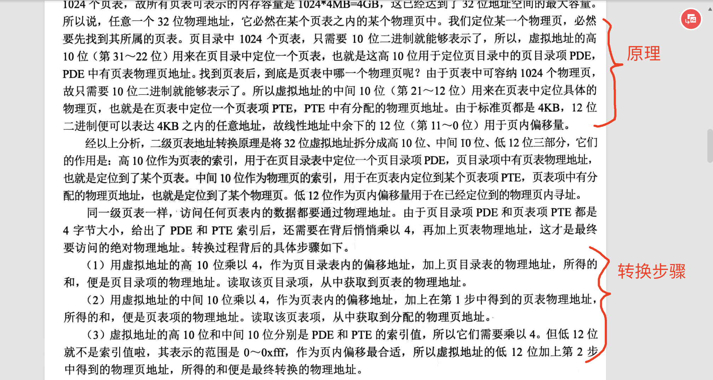

# 开启分页功能

该小节的代码对随书代码进行了改动，改动点如下  
1、原书5.2小节中并没有内核的代码,我增加main.asm用来测试分页功能是否正常。loader在开启了分页后,使用jmp指令跳转到`0xc0000000`，也就是main.asm
如果代码能够正常执行，说明映射关系`0xc0000000 -> 0x1000000`已经成功了，然后会在屏幕上输出`kernel`字符串。

2、随书代码中事将内核代码加载到1mb地址内，而我将内核代码加载16mb处，从而导致创建PDE与PTE的代码不同了。
低端的1mb内存映射关系是 `0x00000 -> 0x00000` 也就是维持原样。


该小节的几个知识点：    
1、以段基址+偏移量方式访问内存的弊端  
2、为什么不采用虚拟地址与物理地址一一对应的方案  
3、一级分页有什么问题  
4、二级页表与一级页表的地址转换上的区别
5、bochs如何查看页表


## 段基址+偏移量的问题

因为 `段基址+偏移量 = 线性地址 = 物理地址`
所以段只能整段载入内存，内存地址必须是连续的，会出现内存碎片问题。例如，内存剩余可用空间为3mb,需要载入的程序刚好是3mb，理论上是可以载入的，但如果
这3mb的内存是由两段不连续的 1mb + 2mb，则无法载入程序。

因此增加了一层映射使得内存不需要连续也能使用。线性地址 ->  物理地址，例如
地址  线性地址是 0x0001 ，其对应的物理地址  是  0x1000. 

## 虚拟地址与物理地址一一对应的问题

### 映射关系占用内存太多
一个32位的虚拟地址需要4个字节来表示，如果采用一一对应的方案。虚拟地址与物理地址的映射关系需要存储在内存中，
则1字节的物理地址占用4个字节的内存。4G大小的内存共` 4（4个字节） * 4 * 1024(g) * 1024（mb）* 1024(k) * 1024(Byte) `个字节 
此时占用内存为 `4 * 4g = 16G` 这很不合理。

所以上面的问题在于 4个字节只对应了一个字节，需要把全部内存映射完需要的内存太多了。减少占用内存的方法就是
将映射的数量（页表项）降低下来，通过调整内存块的大小，也就是4个字节的虚拟地址对应的不再是一个字节，而是4个字节。

那么4G只需要 1G个 4个字节的虚拟地址就可以了， 此时还是太大了。所以还要继续降低映射的数量，例如现有操作系统默认的4k，则只需要 1m 个虚拟地址即可。
此时映射关系只需要占用内存4mb即可。


### 32位的虚拟地址怎么映射 4K的内存地址

假设有0~39共40个数字，要将它们分成4份，只需要按照 高位的数字划分即可。 例如 高位（十进制位）是0 ，则0~9是一份，高位是1，则10~19。以此类推
最终有以下映射关系：
```text
0  ->  第一份（0~9）
1  ->  第二份（10~19）
2  ->  第三份（20~29）
3  ->  第四份（30~39）
```
因为每一份是有序且连续，所以每一份内的数字都是按顺序存放，不需要做额外的映射关系了。 分成4份后，那么有一个数字是 29 ，
我们可以根据 高位是2 定位到第三份，然后根据偏移量9 可以定位到第三份中的最后一个。

同理可得，虚拟地址是由链接器在合并文件的时候，根据文件空间大小计算得到的，是连续有序的。
高位用来表示属于哪个 4K的内存块，低位用来表示内存块内的偏移量即可。

要表示4k内的偏移量只需要12位即可，2的12次方 = 4096，
因此
```text
虚拟地址 = 高20位用来表示内存块 + 低12位表示内存块内的偏移量
```

## 一级分页问题


虚拟地址映射到物理地址就是操作系统中的分页功能。 前面说的32位地址 分层1M个内存块这种方案叫一级分页。一级分页的弊端,以下是我自己的感想:

1、一级分页在大段内在回收效率没有多级分页高。
例如，回收4m内存，以一级分页功能，则需要处理1024个分页，以及二级分页为例，一个目录项对应 1K个 4K分页，只需要更新 一个页目录项即可。

2、多级分页可以在页目录项、页表项中写入管理信息，方便管理

3、启动效率低
以32位操作系统来说,需要占用虚拟地址为3g~4g的虚拟地址空间，然后在操作系统上运行程序时，使程序的虚拟地址空间高位部分与操作系统虚拟地址空间一样，这样子程序就能
使用操作系统上的例程。 所以操作系统运行前需要先创建页表，建立映射关系然后才能运行程序。如果只有一级分页，需要先创建好所有的分页面。然而并不是所有内存都会用上的，
所以有很多映射关系并不需要创建。

## 二级分页与一级分页的区别

一级分页是将 `4G = 1M个4K`分页，二级分页是 ` 4G = 1K页表 * 1K个4K分页`，
不同的地方是地址转换的方法不同以及二级分页的页目录项与页表项中可以写入权限信息，方便管理。

### 二级分页的地址转换



### 页表地址值、页地址值的要求
页表的地址值与页的地址值必须是0x1000的整数倍，因为要留低12位来存储属性值


页目录项的地址值存放在哪里都可以，因为获取第N个页目存储值的方式是 `[起始地址 + n-1 * 4]`的方式计算的到的，只需要知道起始地址以及索引值即可。
要启用分页时我们已经处于保护模式下,已经突破了1mb的内存限制了，就不用考虑挤在1mb里面，害怕与bios或者硬件占用的内存地址冲突了。

所以第一个页目录的位置 = 起始位置可以选取在 0x100000的位置，第二页目录项地址是 0x100000 + 0x4，其余的都是通过
基址 + 索引值的方式计算得到。

页表地址也必须是0x1000的倍数，可以选在0x101000处，因为整个页目录结束地址是0x100fff,0x101000是空闲的。
下一个页表的地址值为0x101000 + 0x1000 = 0x102000 因为一个页表占用4K .
页地址也必须是0x1000的倍数，页地址就是最终的映射地址物理地址的基址，以32位系统来举例，就是要将4G拆分成 1000 * 1000 个 4K (0x1000)


## bochs查看页表
```bash
<bochs:24> info tab
info tab
cr3: 0x000000100000
0x0000000000000000-0x00000000000fffff -> 0x000000000000-0x0000000fffff
0x00000000c0000000-0x00000000c0000fff -> 0x000001000000-0x000001000fff
<bochs:25> x 0xc0000000
x 0xc0000000
[bochs]:
0x00000000c0000000 <bogus+       0>:	0x8e0018b8
```
info tab命令可以查看页表的映射关系，如上，我将0xc0000000 映射到 0x1000000处。由于只建了一个页表项，因此是
`0xc0000fff -> 0x1000fff`

其次，x命令可以通过给出虚拟地址 查看映射的物理地址的内容。